# Lc0 preprocessing pipeline (SARDINE v1)

_Piano per trasformare `data/raw/lc0/chunks/*.gz` in un training set per la NNUE bucketed SARDINE.  
Riferimenti: [SARDINE Engine Blueprint](SARDINE%20Engine%20Blueprint.md) §Training data, [TODOs.md](../TODOs.md) §C, smoke test `scripts/smoke_test_lc0_chunk.py`._

---

## Obiettivo

Produrre un dataset **processed** sotto `data/processed/lc0/` con:

| Campo | Uso |
|-------|-----|
| **FEN** (o `chess.Board` ricostruibile) | `encode_dual()` → 716 feature sparse SARDINE |
| **`bucket_id`** | router a 8 expert head in training/inference |
| **`sf_cp`** | target eval **centipawn** Stockfish, prospettiva side-to-move |
| metadati leggeri | ply, `plies_left`, visits, shard di provenienza |

**Non** addestriamo sulla policy Lc0 (1858 prob) né sui piani Lc0 nativi (768/112): il feature space del motore è **716 pruned**, già implementato in `src/tinymlinternship/features/`.

---

## Stato attuale (smoke test)

- Chunk V6, `input_format = 1` (classical): parser in `src/tinymlinternship/data/lc0_parser.py`.
- Bit planes → FEN → `python-chess`: **~97%** posizioni legali su chunk campione (36/37).
- Fix noti: ordine king/queen nei piani Lc0; sanitizzazione castling incoerente (`KQkq` → `-`).
- **Fatto:** game grouping (`plies_left` reset), filter per-bucket min_ply, stats gate, pilot `positions.parquet`.
- **Non ancora fatto:** labeling Stockfish, training nnue-pytorch.

---

## Diagramma pipeline

```mermaid
flowchart LR
    RAW["data/raw/lc0/chunks/*.gz"]
    PARSE["1 · Parse V6 records"]
    FEN["2 · Planes → FEN → Board"]
    GAME["3 · Raggruppa per partita"]
    FILTER["4 · Filtro posizioni"]
    SAMPLE["5 · Campionamento per bucket"]
    LABEL["6 · Label Stockfish"]
    EXPORT["7 · data/processed/lc0/"]
    TRAIN["8 · nnue-pytorch (716→16→1)"]

    RAW --> PARSE --> FEN --> GAME --> FILTER --> SAMPLE --> LABEL --> EXPORT --> TRAIN
```



---

## Fase 1 — Parse chunk

**Input:** un file `.gz` (protobuf V6 concatenato, 8356 B/record).  
**Output:** stream di `Lc0Position` (FEN + metadati Lc0).

Metadati utili già nel record V6:

| Campo Lc0 | Significato | Uso in pipeline |
|-----------|-------------|-----------------|
| `best_q`, `root_q` | Q dopo search Lc0 | **Non** target v1; opzionale sanity / confronto |
| `result_q`, `result_d` | WDL outcome della partita | **Non** target v1 (vedi §Risultato partita) |
| `played_q`, `played_idx` | mossa giocata | ignorato v1 (no policy head) |
| `plies_left` | stime ply rimanenti | ricostruzione ply + taglio apertura |
| `visits` | visite MCTS | filtro qualità opzionale |
| `invariance_info` bit 6 | segnata per delete dal rescorer | **scarta** |
| `invariance_info` bit 5 | partita adjudicated | flag in metadati |

**Limite v1:** solo `input_format == 1`. Chunk canonical (3/4/132) in altri shard → parser separato o skip.

---

## Fase 2 — Board state: sì, via FEN

**Sì, calcoliamo lo board state** — ma non teniamo i piani Lc0 come input di training.

Percorso scelto:

```
uint64 planes[0:12]  →  FEN  →  chess.Board  →  encode_dual(board)  →  sparse 716
```

**Perché FEN e non i piani Lc0?**

1. SARDINE ha un encoder proprietario (716 dim, king mirror, castling frame, EP) — deve essere **identico** su PC e device.
2. I piani Lc0 (112/classical stacked history) non mappano 1:1 sul nostro index map.
3. `python-chess` ci dà validazione legale e `bucket_id()` gratis.

**Cosa persistiamo su disco (processed):**

- **Minimo:** `fen`, `bucket_id`, `sf_cp`, `ply`, `game_id`.
- **Opzionale:** coppie sparse `(feature_index, 1)` pre-calcolate — solo se il dataloader è troppo lento; default = encode on-the-fly da FEN.

**Cosa non persistiamo:** vettori densi 716, piani Lc0 raw, policy 1858 float.

---

## Fase 3 — Raggruppo partite

I record in un chunk sono **sequenziali per partita** (standard Lc0 training data). Non c’è un campo “game id” esplicito.

**Euristica v1:**

- Walk sequenziale nel chunk.
- **Nuova partita** se `plies_left` aumenta rispetto al record precedente (reset) *oppure* salto > 1 ply non spiegabile.
- Da `plies_left` alla fine della partita si ricava `game_plies ≈ plies_left_at_first_record` (da verificare su campione).

Output: `game_id` sintetico per shard (`{chunk_stem}:{game_idx}`).

---

## Fase 4 — Filtri: partite corte vs posizioni in apertura

Il blueprint cita **«games ≥ 16 moves»** — va interpretato con precisione.

### Mosse vs ply (ambiguità da chiudere)

| Termine | Unità | Esempio |
|---------|-------|---------|
| **move** (blueprint, Kaggle `moves` column) | 1 mossa completa (una metà-mossa per colore nella coppia) | 16 moves = 16 SAN in `games.csv` |
| **ply** (half-move, nostra pipeline) | 1 metà-mossa | startpos = ply 0; dopo `1.e4` = ply 1 |

`plot_piece_count_distribution.py --min-moves 16` filtra **partite** con almeno 16 mosse SAN, ma include **tutte** le posizioni di apertura dentro quelle partite (nessun taglio ply sulle posizioni).

**Default pipeline:** `min_ply = 32` (= 16 full moves) per allineare l’aggressività del blueprint, non `ply >= 16` (= 8 mosse).

### Partite intere sotto 16 mosse

**Probabilmente non serve un filtro duro sulle partite.**

- I dati Lc0 sono self-play ad alto livello: le partite **complete** raramente finiscono prima di 16 mosse.
- Eccezioni: adjudication (bit 5), timeout nel generatore, posizioni duplicate/rescorer — pochi %.

**Piano:** non scartare a priori per `game_plies < 16`. Loggare la distribuzione; applicare filtro solo se la coda è > ~1–2% e distortiva.

### Salto posizioni in apertura (sì, utile)

Il vero problema non sono partite corte, ma il **sovrappeso dell’apertura** dentro partite lunghe:

- Ogni partita contribuisce ~16–30 posizioni con 32 pezzi → bucket 7 gonfiato (già visto su Kaggle in `piece_count_distribution_10k.xlsx`).
- Stessa logica del FIDE dataloader (Linrock): *skip first N plies* — non “elimina partite corte”.

**Fase 4 vs Fase 5 — complementari, non ridondanti:**

| Fase | Risolve | Senza l’altra |
|------|---------|---------------|
| **4 · filtro ply** | **Diversità** dentro ogni bucket (meno startpos/apertura clone) | Fase 5 campionerebbe ancora da un pool quasi tutto apertura |
| **5 · stratified sample** | **Bilanciamento tra** bucket (quota ≈ N/8) | Fase 4 sola lascerebbe bucket 6–7 numericamente dominanti |

### Rischio bucket 7 (p = 32)

La prima cattura in molte aperture cade a **ply 16–30**. Un `min_ply` globale aggressivo può **affamare** il bucket 7 prima che la Fase 5 possa bilanciare.

**Mitigazione v1:** `min_ply` **per-bucket** — default globale `32`, bucket 7 relax `8` (`DEFAULT_BUCKET_MIN_PLY` in `lc0_preprocess.py`).

**Gate obbligatorio prima del labeling Stockfish:** `scripts/stats_lc0_processed.py` → tabella survival per bucket; se bucket 7 < N/8, abbassare `bucket7_min_ply`.

**Piano v1 (default):**

| Filtro | Default | Note |
|--------|---------|------|
| `ply >= 32` (globale) | **sì** | = 16 full moves; allineato al blueprint |
| `ply >= 8` (solo bucket 7) | **sì** | preserva posizioni p=32 post-apertura |
| `invariance bit 6` (delete) | scarta | mai settato da lc0, ma gratis |
| `visits >= V_min` | opzionale (es. 100) | qualità search; da misurare su subset |
| `board.is_valid()` | sì | post-sanitizzazione castling |

**Parametri CLI:** `--min-ply`, `--bucket7-min-ply`.

---

## Fase 5 — Campionamento bucket-stratified

Dopo i filtri, la distribuzione `bucket_id()` resta sbilanciata verso middlegame denso.

**Obiettivo:** ~uniforme su 8 bucket (B-C queen-split), come [design options §12](SARDINE%20design%20options.md).

La Fase 5 **non** sostituisce la Fase 4: downsampling uniforme su un pool di sole aperture ripetute resta poco diversificato.

Procedura:

1. Calcola `bucket_id(board)` per ogni posizione candidata.
2. Target per bucket: `N_total / 8` (o quote minime per bucket rari 0–1).
3. Reservoir sampling / downsampling per bucket sovrarappresentati; cap su bucket 6–7 se necessario.
4. Tenere **validation set** stratificato (es. 5%, stesso schema), **mai** mescolato con train.

**Scala v1 (subset ~1.15 GiB raw):** puntare a **50k–200k posizioni** labeled Stockfish, non l’intero corpus decompresso (decine di milioni di record).

---

## Fase 6 — Label Stockfish (target di training)

**Target primario v1: `sf_cp` centipawn**, prospettiva **side-to-move**, da Stockfish a profondità fissa.

| Parametro | Proposta iniziale |
|-----------|-------------------|
| Engine | Stockfish 16+ (PATH o `python-chess` UCI) |
| Depth | 12–14 (compromesso qualità/tempo) |
| Nodes | opzionale cap per posizione |
| Output | `cp` da `info score cp` (mate → ±30000 clamp) |

**Batch offline:** script `scripts/label_lc0_stockfish.py` (da scrivere) — resume, cache per `fen`, pool multiprocessing.

**Non** usiamo `best_q` Lc0 come label finale: è WDL-normalizzato per le reti Lc0, non centipawn allineati al nostro output CReLU/tanh e alla gate Elo vs motori classici.

---

## Risultato partita: come lo usiamo in training?

### Risposta breve: **non come loss principale in v1**

La NNUE di valutazione statica impara **«chi sta meglio in questa posizione»**, non **«chi vince la partita»**.

| Segnale | Fonte | Ruolo v1 |
|---------|-------|----------|
| **Stockfish centipawn** | fase 6 | **target principale** — regressione eval |
| `best_q` / `root_q` Lc0 | record V6 | diagnostica; eventuale pre-filter qualità |
| `result_q`, `result_d` | record V6 | **ignorato** — è outcome WDL della partita, utile per training **policy/value Lc0**, non per micro-NNUE stile Stockfish |
| Esito W/L/D da `result_q` | derivabile | **non** mixed nella loss v1 |

**Perché ignorare l’outcome?**

1. Outcome è **rumoroso** per singola posizione (posizione +3.0 può essere in partita persa).
2. Lc0 stesso traina Q con blend di search + outcome; noi vogliamo eval **statica** compatibile con search alpha-beta + TT.
3. Blueprint e TODOs esplicitano **Stockfish labels**, non outcome Kaggle-style.

### Uso futuro (v2+, non pianificato ora)

- **Auxiliary head** WDL con peso basso (distillation da Lc0).
- **Filtro qualità:** scartare posizioni dove `|best_q|` è estremo e visits bassi.
- **Curriculum:** partite decisive per bucket tattici — solo se ablation lo richiede.

---

## Fase 7 — Artefatti su disco

```
data/processed/lc0/
├── manifest.json          # versione pipeline, hash shard, conteggi
├── positions.parquet      # fen, bucket_id, ply, game_id, lc0_best_q, visits, …
├── labeled.parquet        # + sf_cp, sf_depth, label_ms
└── splits/
    ├── train.parquet
    └── val.parquet
```

Schema minimo `labeled` per training:

```text
fen, bucket_id, sf_cp, ply, game_id
```

Lo script di training legge FEN → `encode_dual()` → batch sparse → rete bucketed.

---

## Fase 8 — Collegamento a nnue-pytorch

SARDINE **non** usa l’input 768 HalfKP di Stockfish. Piano:

1. Fork/adattare dataloader nnue-pytorch per **feature index list** da `encode_dual()`.
2. Shared layer 716→16 + 8 teste 32→1; loss MSE (o huber) su `sf_cp` normalizzato.
3. CReLU hidden **e** output (no tanh LUT — vedi [TODOs.md](../TODOs.md) §C).
4. Export int8 post-training + misura gap fp32→int8.

---

## Script previsti (ordine di implementazione)

| Script | Fase |
|--------|------|
| `scripts/smoke_test_lc0_chunk.py` | ✅ smoke parse |
| `scripts/stats_lc0_processed.py` | ✅ survival bucket × min_ply (gate pre-labeling) |
| `scripts/prepare_lc0_dataset.py` | ✅ 1–5: parse, FEN, filter, sample → `positions.parquet` |
| `scripts/label_lc0_stockfish.py` | 6: `positions.parquet` → `labeled.parquet` |

---

## Rischi e check prima del full run

1. **% `input_format != 1`** negli shard — se > 0, estendere parser o filtrare.
2. **Distribuzione `ply` dopo filtro** — confrontare con `excel/piece_count_distribution_10k.xlsx`.
3. **Costo labeling** — stimare: 100k pos × ~0.5–2 s/pos @ depth 12 → ore/giorni; campionare prima 5k.
4. **Accordo FEN parser vs encoder** — golden test: FEN da Lc0 → `encode_dual` vs stesso board da mossa UCI (parity spot-check).

---

## Decisioni esplicite (per evitare ambiguità)

| Domanda | Decisione v1 |
|---------|----------------|
| Filtrare partite < 16 mosse? | **No** (salvo log anomalie); filtrare **posizioni** con `ply < 32` (16 mosse), bucket 7: `ply < 8` |
| Calcolare board state? | **Sì** — FEN da piani, poi `chess.Board` |
| Usare risultato partita nel training? | **No** come target; **sì** Stockfish `sf_cp` |
| Usare piani Lc0 come input? | **No** — solo SARDINE 716 via `encode_dual` |
| Precomputare sparse 716? | **Opzionale**; default encode a train time |

---

[← Indice Notes](_notes.md)