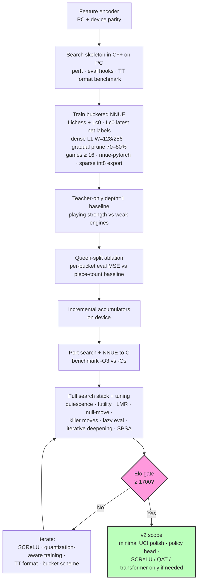
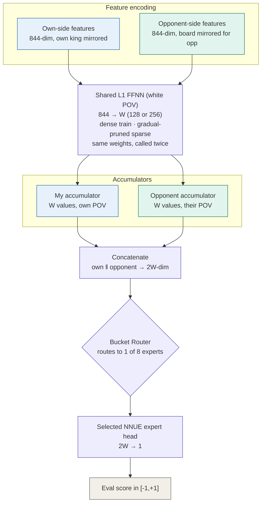
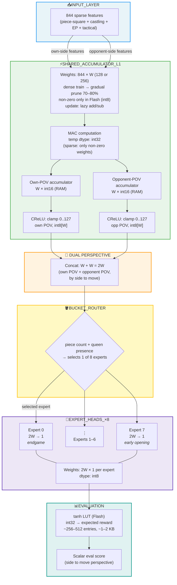

Chess engine for the **Wio Terminal** — neural evaluation + alpha-beta search, maximizing **Elo per byte** under 192 KB RAM / ~500 KB flash.

*Alternative designs considered: [[SARDINE Engine Blueprint]].*

---

## Mission

Playable chess bot on a tiny device: no cloud, no GPU. Extreme optimization and efficiency. Ideally, we will be able to play against it on *Lichess*. 

The hope is also to make a setup where we can later transpose the project to a different filed (accumulator layers + world models?)

---

## Targets

| Parameter         | Decision                                       |
| ----------------- | ---------------------------------------------- |
| Elo               | ~ 1700  (gate minimo; se superiamo, meglio)    |
| Move time         | Best move within  ~1 s                         |
| Alpha-Beta search | likely more suitable than MTCS (no policy net) |
| Nets              | NNUE for eval <br >policy head (maybe later)   |

Node budget reference: Urusov's ESP32 engine (~20 kNps, heuristics-only, ~2023 Elo) sets a baseline for search throughput without NNUE. SARDINE's reachable depth in ~1 s depends on measured eval latency + move-gen overhead on Wio — model empirically once the search skeleton exists.

---

## Build Pipeline



---

## MoE + NNUE Architecture



The L1 accumulator (green) is computed once per position and **shared across all 8 expert nets** — only the output head selected by the bucket router (orange) changes. Train the L1 dense at $W \in \{128, 256\}$, applying **gradual pruning during training** up to 70–80% sparsity; store only non-zero weights in flash. Incremental add/sub updates on the accumulator are bucket-agnostic.

---

## Design Decisions


### Runtime (phased)

Pure C engine core (Cfish-style) is the target, but port after the first playable search exists in C++ on PC.

Rationale: debugging alpha-beta, quiescence, and TT interactions is far faster with a PC toolchain (debugger, sanitizers, perft/eval unit tests) than on Wio hardware. Minimal C++ remains acceptable for TFT/Serial glue on-device.

Compiler flags: once the C port lands (build step 6), benchmark `-O3` vs `-Os` on Wio — a free recompile experiment; no decision needed upfront. FIDE 9th place gained significant speed from `-O3` after gutting unused features.

MicroChess bare-metal patterns: skip — not worth diverging from a standard alpha-beta skeleton for v1.

### Input features

Pruned **844** features: 716 base + 128 tactical. HalfKP deferred.

Input structure:

$$6 \times 2 \times 64 - 2\times16 - 32 + 4 + 8 + 64 + 64 = 844$$

- $768$ raw piece-square (6 types × 2 colors × 64 squares)
- $-32$ pawn ranks 1/8 omitted from index map
- $-32$ perspective-king plane compressed 64→32 (enemy king keeps full 64-square resolution)
- $+4$ castling rights · $+8$ en passant file
- $+64$ pieces under attack (one bit per square, perspective frame)
- $+64$ pieces attacking king (one bit per square, perspective frame)

Implementazione: `index_map.py`, `encoder.py`, `mirror.py`, `tactical.py`, `bucket.py` — test: `tests/test_features.py`, `tests/test_tactical.py`.

Separate pattern tables: skip for v1. Geometric zeros (impossible pawn ranks, king mirroring) plus L1 gradual pruning during training already capture the cheapest compression wins; a handcrafted pattern cache adds flash complexity for uncertain gain until the Elo gap is measured.

### NNUE Architecture



### Evaluation

Bucketed micro NNUE: `844 → W → 1` with $W \in \{128, 256\}$, dual-perspective, 8 output weight sets (experts) selected by position bucket.

**L1 shared layer:** train dense ($844 \times W$), applying **gradual pruning during training** up to 70–80% sparsity. Export and store **only non-zero weights** in flash (sparse index + int8 value). All 8 NNUE expert nets share this pruned L1; expert heads differ only in the $2W \rightarrow 1$ output weights. Pick $W$ empirically (128 vs 256) from eval latency on Wio and depth=1 / Elo baselines.

Activations: CReLU on the shared hidden layer ($844 \rightarrow W$); tanh on the final scalar output ($2W \rightarrow 1$ per expert). The tanh is never computed at runtime — apply a precomputed lookup table indexed by the clipped int16 dot-product, mapping to **expected reward** in $[-1, +1]$ (side to move perspective). LUT lives in flash (~1–2 KB for 256–512 entries); training in `nnue-pytorch` uses tanh so export matches inference.

Shared accumulator: all experts share the same first hidden layer. The accumulator depends only on board features, not on which output bucket is active — compute it once per position, then route to the correct output head. Matches Stockfish-style bucketed NNUE; incremental add/sub updates stay bucket-agnostic.

Autoencoder warm-start: skip for v1.

Tactical MoE (`inCheck`, capture threat): defer to v1.x/v2. Bucket switches are already infrequent along a typical game (piece count mostly decreases), so the current 8-bucket scheme is not leaving large gains on the table — no urgency to add tactical heads earlier.

### Output buckets

Balanced training buckets (based on number of pieces $p$, kings included) with queen-split (for now) in middlegame/opening bands:

| Bucket | Condition | Phase |
| --- | --- | --- |
| 0 | $p \le 12$ | endgame |
| 1 | $p \in [13,21]$, no queen | late middlegame |
| 2 | $p \in [13,21]$, queen present | late middlegame |
| 3 | $p \in [22,27]$, no queen | middlegame |
| 4 | $p \in [22,27]$, queen present | middlegame |
| 5 | $p \in [28,31]$, no queen | opening |
| 6 | $p \in [28,31]$, queen present | opening |
| 7 | $p = 32$ | early opening |

Queen presence is high-leverage in buckets 1–4. Buckets 0 and 7 barely need the split.

Ablation plan: train queen-split vs pure piece-count buckets once pipeline exists. Compare per-bucket eval MSE on a teacher-labeled validation set (natural bucket mix like training) — not pooled MSE alone. Escalate to playing-strength tests only if per-bucket results are ambiguous or contradictory.

Informed by `piece_count_distribution_10k.xlsx` (games ≥ 16 moves). Training keeps the **natural bucket distribution** from Lichess PGNs — no stratified resampling.

#todo testing with fewer/different buckets (queen split vs only piece count)

### Policy (v1)

Search-only for v1. Add killer-move once tables are in (no policy network for now).

Policy guidance net (v2): defer until after v1 Elo gate. Lightweight head off the shared accumulator ($W \rightarrow$ move-ranking); watch per-node latency against the ~1 s budget.

Compact transformer fallback: the ~210K design in [chess transformer.md](chess%20transformer.md) stays in reserve — evaluate only if the lightweight policy head underperforms post-gate. Too heavy for per-node move ordering to pursue in parallel; last resort, not a parallel track.

Killer moves are a complementary heuristic for non-capture moves. The idea: if a particular quiet move (not a capture) caused a beta cutoff (i.e., it was so strong the search stopped exploring further alternatives at that depth) in one branch of the tree, it's often also a strong move in sibling branches at the same depth — even though the board position is slightly different. Chess tactics are often tied to squares and piece maneuvers rather than the exact position, so a move like "knight jumps to a strong central square" that worked well once tends to work well again nearby in the tree.

### Incremental updates & lazy evaluation

- Add/sub accumulator updates on each move (shared layer — bucket-independent)
- Lazy accumulator updates — defer refresh until eval is actually needed (TT cutoffs skip work)
- Lazy evaluation — skip full NNUE forward when a beta cutoff is already provable from a prior ply score; implement together with lazy accumulator updates (same "skip work when cutoff makes it moot" principle)
- Copy-make + fused add/sub optional later

### Geometric optimizations

- Horizontal king mirroring
- Hard-zero weights for impossible states (pawns on rank 1/8)
- L1 gradual pruning during training: up to 70–80% sparsity; sparse flash storage (non-zero only)

### Quantization

| Tensor            | Precision    | Note                                                                      |
| ----------------- | ------------ | ------------------------------------------------------------------------- |
| L1 weights        | int8         | Sparse in Flash (non-zero only, ~20–30% of $844 \times W$ after pruning)  |
| Expert weights    | int8         | Dense $2W \times 1$ per bucket, Flash                                     |
| Biases            | int16        | Larger scale needed for offset                                            |
| Accumulator (RAM) | int16        | $W$ values per POV; lazy add/sub                                          |
| MAC temporaneo    | int32        | Solo durante il calcolo, non persistito; sparse L1 MAC skips zero weights |
| Hidden activation | CReLU (int8) | Post-clamp [0, 127]                                                       |
| Output activation | tanh LUT     | Expected reward in $[-1,+1]$, no runtime tanh                             |

Scale calibration: train fp32 first, histogram post-training weights, set per-tensor scales onto $[-127, 127]$ with minimal clipping.

Tanh LUT: after int16 output-head dot-product, clip to LUT index range, fetch expected reward from table. Generate LUT offline from training scale + desired $[-1,+1]$ range; verify fp32 tanh vs LUT max error on validation set before Wio export.

SCReLU fallback — first upgrade if hidden CReLU plateaus below ≥1700 Elo: clip before square (int16), multiply-accumulate in int32 (required: $2W \times 127^2$ can exceed int16 max). Output tanh + LUT unchanged.

Grapheus / quantization-aware training: skip for v1. **PTQ only** initially (calibrated int8 export from fp32 weights); trigger QAT only if MSE > 0.01 or Elo drop > 30 vs fp32.

### Search

Phased rollout:

- Alpha-beta + quiescence
- Futility pruning + late-move reduction + null-move pruning (futility is cheap, well-proven at this speed class — include in v1, not deferred)
- Lazy evaluation (paired with lazy accumulator updates)
- Iterative deepening once TT is stable

Stack surfing (MicroChess-style dynamic depth): rejected for v1. With TT already claiming 128–160 KB of 192 KB RAM, probing free stack at runtime to extend depth is too risky alongside accumulators and search stack.

Fixed depth / iterative deepening within the ~1 s budget replaces dynamic stack-based depth.

### Memory

| Resource | Philosophy  | Allocation                                                   |
| -------- | ----------- | ------------------------------------------------------------ |
| Flash    | Balanced    | ~10% weights; rest search code + tables;  no opening book v1 |
| RAM      | TT-dominant | TT  128–160 KB ; accumulators ($2W$ int16) + stack ~16–32 KB; scratch ~16 KB |

RAM risk: 192 KB − 160 KB TT ≈ 32 KB margine — TFT_eSPI buffer (~30 KB) può consumare quasi tutto. Per partite reali: TFT off durante search, Serial/UCI per debug; TFT solo bring-up.

Opening book: defer until after Elo gate. Dog ships one, but flash is better spent on search + NNUE for v1.

Dog (ESP32) reference: Dog fits NNUE + TT + book in ~320 KB RAM at ~1700+ Elo on-device — proof the target is feasible. RAM layout study still useful (see Open Questions) but TT-dominant plan stands.

### Transposition table

Design entry format first; slot count follows from 128–160 KB budget. Prototype on PC (build step 2), then benchmark on Wio.

Candidate entry: truncated zobrist, best move (~16 bit), score (16 bit), depth (8 bit), bound type (2 bit).

| Format       | Size  | Slots @ 128 KB | Trade-off                                                                |
| ------------ | ----- | -------------- | ------------------------------------------------------------------------ |
| Tight pack   | ~10 B | ~13,100        | More entries; unaligned loads on SAMD51 cost extra shift/merge per probe |
| Byte-aligned | 16 B  | ~8,200         | Fewer entries; faster probes                                             |

Decision metric: wall-clock nodes/sec and depth reached in ~1 s on Wio — not hit-rate alone.

### Move ordering

MVV-LVA + captures for v1; killer moves when search depth > 4.

Move ordering is about the order in which a chess engine tries moves at each node in the search tree — not which moves are legal, but which ones get examined first. This matters enormously because of alpha-beta pruning: alpha-beta can skip whole branches of the search tree once it proves a move is "good enough" that the opponent would never let you reach it, but how much it can skip depends entirely on whether the best moves get searched early. If you search the best move first, alpha-beta prunes aggressively and the search is fast. If you search it last, you've wasted time fully exploring worse alternatives before finding it, and pruning barely helps. Good move ordering can be the difference between searching a few thousand nodes and a few million to reach the same depth.

### Training data

**Teacher target: expected reward** — not centipawn score. The teacher value function labels each position with expected game outcome from side to move's perspective (e.g. WDL → scalar in $[-1,+1]$ via tanh). Matches the NNUE output head design; avoids a separate centipawn calibration step.

**Position diversity matters.** Super-bot self-play alone under-represents human mistakes, odd structures, and common-but-suboptimal positions. Primary position source: **human games** (Lichess-style datasets) — sample FENs from real games, then label with the teacher. Supplement with **Lc0 training games** for extra volume and strong-play coverage (more data = better).

**Reuse existing datasets if possible.** Before building a custom labeling pipeline, survey community mirrors for pre-labeled Lichess/Lc0 dumps (expected reward or WDL from a strong teacher). Saves significant time if a compatible format already exists.

| Fonte               | Ruolo                         | Note                                                                                                                                                 |
| ------------------- | ----------------------------- | ---------------------------------------------------------------------------------------------------------------------------------------------------- |
| Lichess human games | Posizioni principali (diversità) | Campionare FEN da partite umane; teacher etichetta expected reward. Cercare dataset già etichettato.                                                 |
| Lc0 training games  | Supplemento / volume          | Subset filtrato (~1–2 GB locale, non il corpus completo); formato training-data / `.bin` Lc0                                                        |
| Kaggle  `games.csv` | Smoke test / statistiche      | Già via  `scripts/download_data.py`;  `non` per training NNUE (partite deboli, label outcome)                                                        |
| Filtro              | Games  ≥ 16 mosse             | Allineato a  `piece_count_distribution_10k.xlsx`                                                                                                     |
| Resampling          | Natural distribution          | No stratified resampling — queen-split ( `bucket_id()` ) solo per routing; vedi tabella Output buckets                                              |

**Teacher v1 (deciso):** Lc0 value head — **latest best network** da [training.lczero.org](https://training.lczero.org/) via `lc0` UCI; `expected_reward = W − L` da WDL nativo. Label on-the-fly (`position fen …` + `eval`). Fallback: Stockfish `UCI_ShowWDL`. Vedi [Models.md](Models.md) · [Datasets.md](Datasets.md).

Prossimi script: survey existing labeled datasets; `scripts/download_lichess.py` and/or `scripts/download_lc0.py` — download incrementale, checksum, path sotto `data/raw/`. Valutare mirror ufficiali e subset pre-processati della community prima di scaricare TB interi.

**Early baseline:** before investing in the full search stack, measure how strong a bot is that uses **only the teacher eval at depth=1** (one-ply search, no heuristics beyond legal moves). Sets a floor on label quality and NNUE capacity.

### Training pipeline

| **Stage** | **What we do** |
|-----------|----------------|
| **Data** | Label positions on‑the‑fly using **Lc0’s latest best network** (UCI, `position fen …` + `eval` → WDL → expected reward `W‑L`). |
| **Framework** | **nnue‑pytorch** (Stockfish’s training codebase), adapted to SARDINE’s 844‑input / bucketed architecture. |
| **Bucketing** | No resampling — use the **natural distribution** of bucket frequencies from Lichess PGNs. |
| **L1 width & sparsity** | Train **dense** (`W = 128` or `256`), then apply **gradual pruning during training** up to 70‑80% sparsity (weights are gradually zeroed over epochs). |
| **Quantization** | **PTQ only** initially (calibrated int8 export). If the FP32→int8 gap exceeds threshold (MSE > 0.01 or Elo drop >30), we trigger QAT as a fallback. |
| **Validation** | Train for a **fixed 100 epochs**; save the best checkpoint (by validation loss) and also keep the final model. |
| **Baseline check** | Run **depth‑1 matches** against weak reference engines (e.g., Sunfish, heuristic‑only) to confirm label/NNUE quality before investing in full search. |
| **Tuning** | Use **SPSA** only on **search parameters** (pruning thresholds, LMR depth, null‑move, etc.) — no NNUE eval‑scaling tuning. |
| **Export** | **nnue‑pytorch export script** that outputs sparse int8 L1 weights, dense int8 expert weights, and a tanh LUT for final evaluation on the Wio. |


### I/O

TFT + Serial for on-device display and debug output.

Minimal UCI over Serial: yes — required for standardized Elo testing against the ≥1700 gate. Full UCI spec not needed; implement enough of the protocol for engine-vs-engine tools (cutechess-cli, etc.). Hardcoded FEN remains fine for early bring-up; UCI lands before or during Elo gate testing.

TFT = Thin-Film Transistor LCD on the Wio Terminal (2.4" onboard screen).

---

## Fallback Ladder

If the primary NNUE + search plan fails to reach 1700 Elo, the following fallbacks are pre-scoped:

| Level | Trigger        | Action                     | Rework            |
| ----- | -------------- | -------------------------- | ----------------- |
| 1     | Eval > 3ms     | Reduce $W$ 256→128 (or prune harder) | Retrain (2d)      |
| 2     | Depth < 6      | Reduce TT 128→64 KB        | Recompile (1h)    |
| 3     | Elo < 1600     | Aggressive pruning tuning  | SPSA (2d)         |
| 4     | Still < 1600   | Remove MoE → single expert | Retrain (5d)      |
| 5     | Still < 1500   | No-NNUE heuristics-only    | Rewrite eval (2w) |
| 6     | < 4 weeks left | Material-only eval         | Simplify (1w)     |

**Decision authority**: I (the developer) trigger Level 1-2 autonomously. Level 3+ requires supervisor sign-off.

---

## Benchmark Infrastructure

Continuous measurement of strength, speed, eval quality, and ship readiness — not a one-shot post-training check.

### Purpose

Benchmark infrastructure answers five questions continuously, not only at the end of training:

1. **Strength** — is this recipe stronger than last week?
2. **Speed** — is eval/search fast enough for ~1 s/move (PC proxy now, Wio later)?
3. **Eval quality** — does the student match teacher `expected_reward` on held-out FENs?
4. **Parity** — do PC and device agree after the C port?
5. **Ship gate** — may we claim the ≥1700 path (match Elo), or only “not broken” (ACPL smoke)?

### Scope

| Phase | What we run |
| ----- | ----------- |
| **Now** | Playing strength + **PC** performance microbench + train/eval quality metrics |
| **After C port** | Same metric **schema** on Wio (`platform=wio`): latency, nodes/s, `-O3` vs `-Os`, encoder/NNUE parity |

Device-only benchmarking is **not** the primary loop before the port; PC numbers are proxies and must be labeled as such.

### Playing strength (hybrid)

| Track | Role | Metric name (reports) |
| ----- | ---- | --------------------- |
| **Iteration** | Fast feedback after code/train changes | `elo_acpl_heuristic` (and raw ACPL ± σ) |
| **Gate / milestone** | Credible strength claim | `elo_match` (BayesElo / Ordo / cutechess) + CI |

**Never mix the two Elo numbers in prose without the prefix.** ACPL-mapped Elo is a **heuristic**, not FIDE/Lichess/CCRL.

#### ACPL track (iteration)

- Self-play (or fixed agent recipe) → PGN → Stockfish analyzes each move → average centipawn loss.
- Mapping (documented heuristic): \(\mathrm{Elo}_{acpl} \approx 2855 - 10 \times \mathrm{ACPL}\), with project floor/cap as implemented in `eval_bot_acpl.py`.
- **Judge:** Stockfish at **fixed depth** (not movetime) for cross-machine stability; pin binary under `models/teacher/stockfish/` and record version + depth in every run manifest.
- Multi-game runs preferred for σ; report range / CI when \(n\) is small.

#### Match track (gates)

- Engine-vs-engine under a frozen protocol (time and/or nodes — see Search protocol).
- Prefer minimal **UCI** (Serial on device later; process UCI on PC now) for cutechess-cli / similar.
- Output: W/D/L, `elo_match`, confidence interval; store full PGN.

### Opponents / ladder

**Primary ladder** — frozen recipes (extend `NOTES/agents/*.md`); never silently change opponent strength between runs:

| Rung | Example opponent | Purpose |
| ---- | ---------------- | ------- |
| 0 | Random / legal random | Smoke “moves legal” |
| 1 | Sunfish (fixed depth/recipe) | Weak open-source baseline |
| 2 | HCE @ fixed recipe (e.g. d2, qsearch policy explicit) | Internal heuristic baseline |
| 3 | Prior SARDINE checkpoint / pilot NNUE recipe | Regression vs self |
| 4 | Limited Stockfish (level or tight node/time cap) | Mid ladder toward gate |
| 5 | Gate peer set (documented engines / levels for ≥1700 claim) | Ship criterion |

**Teacher ceiling checks** — sparse, not every commit:

- Include **teacher-eval @ depth 1** (frozen Lc0 net, e.g. labeling net `791556` or documented alternative) as a reference bot.
- Purpose: “are we near the label ceiling?” not daily CI (Lc0 is slow).

### Search protocol under test

| Mode | Use when | Spec |
| ---- | -------- | ---- |
| **Fixed time/move** | Match gates, product-like comparison | e.g. 100 ms and/or **1 s**/move; same TC for all engines in a session; log host CPU |
| **Fixed node budget** | Fair search-stack comparison, Urusov-class reference | e.g. ~20 kN/move (tune once and freeze); report wall time separately |
| **Fixed depth** | Smoke, agent cards, ACPL self-play recipes | e.g. d1 / d2 ± quiescence flags in recipe file — **not** the sole ≥1700 claim |

Default **gate recipe** must be one explicit line in the run manifest (eval net, depth or TC or nodes, qsearch on/off). Research may use a matrix; the gate does not.

### Performance suite

One JSON schema for PC and later Wio:

```text
metric, value, unit, platform ∈ {pc, wio}, recipe_id, commit, timestamp, host_or_device, extra{}
```

**PC metrics (now):**

- Evals/s: HCE, NNUE (named checkpoint), optional teacher
- Nodes/s and time-to-depth at fixed depths
- Self-play ply/s smoke under a recipe
- Optional: TT hit rate, qsearch node share (debug search explosions)

**Wio metrics (when ported):**

- Same names with `platform=wio`
- `-O3` vs `-Os` wall-clock comparison
- Move time under ~1 s budget; peak RAM if measurable

Bulk logs under `bench/runs/<timestamp>/` or `plots/` (large binaries gitignored as needed).

### Parity & correctness

| Gate | When | What |
| ---- | ---- | ---- |
| **Golden FEN vectors** | Now / every net export | Frozen FENs → encoder indices + NNUE score; version goldens with `checkpoint_id` |
| **PC↔device parity** | After C port | Same vectors on device; bitwise or documented atol/rtol (int8 path) |
| **Teacher correlation** | After every production train | On labeled **val** (`expected_reward` only): MSE, Spearman/Pearson; fail or warn on regression thresholds |

Unit tests (perft, features, …) remain mandatory and orthogonal.

### Automation & frequency

| Cadence | Action |
| ------- | ------ |
| **On demand** | CLI/scripts from project root; every run writes a **manifest** (config hash, recipe, commit, paths to JSON/PGN) |
| **Pre-release / weekly** | Full package: multi-game ACPL + match ladder rung(s) + microbench + teacher correlation if a new net shipped |
| CI | Prefer **pytest + cheap goldens**; do **not** require full SF/Lc0 match suites on every PR unless a light smoke is affordable |

### Artifacts & reporting

| Artifact | Content |
| -------- | ------- |
| **JSON** | Metrics + config (ACPL, match summary, microbench, teacher-correlation scores) |
| **PGN** | Games for ACPL/match |
| **Dashboard** | Generated plots over time (ACPL/Elo, nodes/s, val MSE) from the JSON history — for reports / ICTP; regenerate from stored JSON, do not hand-edit |

Naming: include recipe id and date; distinguish `elo_acpl_heuristic` vs `elo_match` in all tables.

### Elo ship gate (dual)

| Level | Criterion | Effect |
| ----- | --------- | ------ |
| **Don't ship broken** | ACPL / smoke match collapses vs last good recipe (threshold TBD in runbook) | Block release; investigate |
| **Claim ≥1700** | **`elo_match`** under frozen TC/nodes + opponent set; CI does not rule out 1700 | Only then treat blueprint Elo target as met |
| **Device claim** | Same match (or accepted proxy) on Wio @ ~1 s/move after PC↔device parity | Final product claim |

ACPL-mapped Elo **alone** is insufficient for the ≥1700 claim.

### Code layout

| Layer | Location |
| ----- | -------- |
| Library | `src/tinymlinternship/bot_eval/` (ACPL, paths, future match helpers, metric schema) |
| CLIs | `scripts/eval_bot_acpl.py`, `eval_game_elo.py`, future `bench_*.py` / match runners — thin wrappers |
| Recipes | `NOTES/agents/*.md` (+ machine-readable twin if needed) |
| Outputs | `plots/`, `bench/runs/`, golden vectors next to tests or `tests/goldens/` |

### Implementation order (practical)

1. Pin ACPL judge to **SF fixed depth**; standardize run manifest fields.  
2. Scripted **PC microbench** (evals/s, nodes/s) → shared JSON metric schema.  
3. Freeze **ladder recipes**; document gate recipe.  
4. Golden FEN vectors for current pilot net; teacher correlation on labeled val when production labels exist.  
5. Match harness (UCI or in-process) for `elo_match`; enable dual ship rule.  
6. Post-port: PC↔device parity, Wio rows in the metric schema, device gate.

### Relation to training data

Bench eval quality (teacher correlation) uses the **same** uniform target as training: teacher **`expected_reward`** (see ASSETS §Uniformity). Do not score the student against Lc0 chunk `best_q` or ChessBench-only labels in production reports.

---

#core
