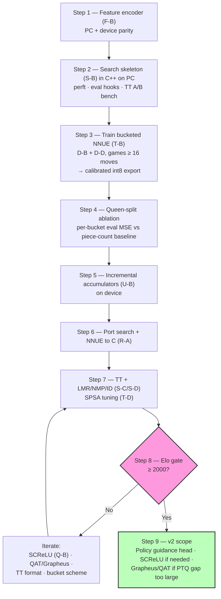
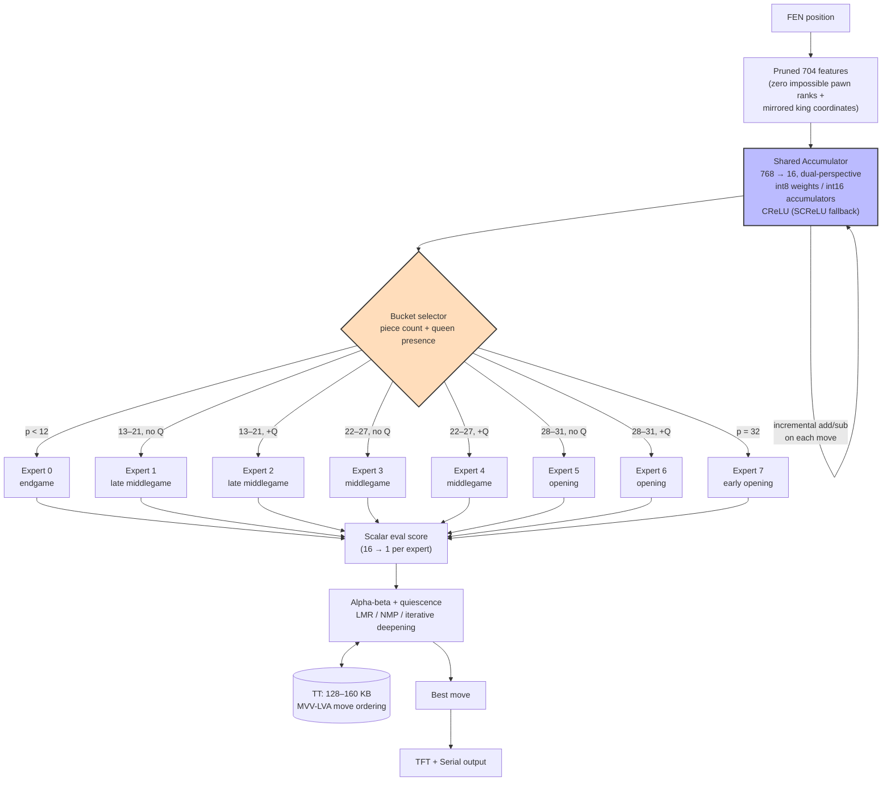

# SARDINE

```
Small Artificial RAM-restricted Deep Intelligent Neural Engine
```


Chess engine for the **Wio Terminal** — neural evaluation + alpha-beta search, maximizing **Elo per byte** under 192 KB RAM / ~500 KB flash.

*Locked 2026-06-30. Full option catalogue: [SARDINE design options.md](SARDINE%20design%20options.md).*

---

## Mission

Playable chess bot on-device: no cloud, no GPU. v1 uses search + NNUE eval; separate policy net deferred.

**Non-goals (v1):** human-like play, Stockfish parity, photo/voice input.

---

## Targets

| Parameter | Decision |
|-----------|----------|
| **Elo** | ≥ **2000** (reference: FIDE Kaggle bots ~2500 Elo at 5 MiB RAM) |
| **Move time** | Best move within **~1 s** |
| **MCTS** | Feasible on-device (1–50 ms/eval); **v2 only** — v1 uses alpha-beta |
| **Nets** | **Separate nets** — NNUE for eval; distinct policy head deferred until after v1 Elo gate |

---

## Build Pipeline



---

## 2. MoE + NNUE Architecture



_The accumulator (blue) is computed once per position and shared across all 8 experts — only the output head selected by the bucket router (orange) changes. Incremental add/sub updates on the accumulator are bucket-agnostic._


---

## Design Decisions

### Runtime — R-A (phased)

Pure **C** engine core (Cfish-style) is the target, but **port after** the first playable search exists in C++ on PC.

Rationale: debugging alpha-beta, quiescence, and TT interactions is far faster with a PC toolchain (debugger, sanitizers, perft/eval unit tests) than on Wio hardware. Minimal C++ remains acceptable for TFT/Serial glue on-device.

---

### Input features — F-B

**Pruned 704** features: zero impossible pawn ranks + mirrored king coordinates. HalfKP deferred.

---

### Evaluation — E-E (E-C)

**Bucketed micro NNUE:** `768 → 16 → 1`, dual-perspective, **8 output weight sets** (experts) selected by position bucket.

**Shared accumulator:** all experts share the same first hidden layer. The accumulator depends only on board features, not on which output bucket is active — compute it once per position, then route to the correct output head. Matches Stockfish-style bucketed NNUE; incremental add/sub updates stay bucket-agnostic.

**Autoencoder warm-start:** skip for v1.

---

### Output buckets — B-C

Balanced training buckets with **queen-split** in middlegame/opening bands:

| Bucket | Condition | Phase |
|--------|-----------|-------|
| 0 | $p < 12$ | endgame |
| 1 | $p \in [13,21]$, no queen | late middlegame |
| 2 | $p \in [13,21]$, queen present | late middlegame |
| 3 | $p \in [22,27]$, no queen | middlegame |
| 4 | $p \in [22,27]$, queen present | middlegame |
| 5 | $p \in [28,31]$, no queen | opening |
| 6 | $p \in [28,31]$, queen present | opening |
| 7 | $p = 32$ | early opening |

Queen presence is high-leverage in buckets 1–4. Buckets 0 and 7 barely need the split.

**Ablation plan:** train queen-split vs pure piece-count buckets once pipeline exists. Compare **per-bucket eval MSE** on a Stockfish-labeled validation set (stratified like training) — not pooled MSE alone, which could hide bucket-level regressions. Escalate to playing-strength tests only if per-bucket results are ambiguous or contradictory; uniform improvement or regression across buckets is decisive enough to skip the expensive test.

**Future axes (v1.x/v2):** no king side, bishop/rook pair, or tactical flags in v1. `inCheck` is the first candidate (8 → 16 buckets) if an axis is added later.

Informed by `piece_count_distribution_10k.xlsx` (games ≥ 16 moves). Training uses **D-D** stratified resampling.

---

### Policy — P-A (v1)

**Search-only** for v1. Upgrade to history heuristics (**P-B**) once tables are in.

**Policy guidance net (v2):** defer until after v1 Elo gate. Lightweight head off the **shared accumulator** (16 → move-ranking); watch per-node latency against the ~1 s budget.

---

### Incremental updates — U-B → U-C

1. **Add/sub** accumulator updates on each move (shared layer — bucket-independent)
2. **Lazy updates** when TT cutoffs make eval skippable
3. Copy-make + fused add/sub optional later

---

### Geometric optimizations — K-A, K-B, K-C

- Horizontal king mirroring
- Hard-zero weights for impossible states (pawns on rank 1/8)
- Magnitude pruning (~80% sparsity post-training)

---

### Quantization — Q-A (SCReLU fallback)

| Tensor | Precision |
|--------|-----------|
| Weights | **int8** |
| Biases | **int16** |
| Accumulators | **int16** |
| Activation | **CReLU** (v1) |

**Scale calibration:** train fp32 first, histogram post-training weights, set per-tensor scales onto $[-127, 127]$ with minimal clipping.

**SCReLU (Q-B)** — first upgrade if CReLU plateaus below ≥2000 Elo:

1. **Clip** int16 accumulator to quantized activation range (e.g. $[0, 127]$) **before** squaring — load-bearing; unclipped $32767^2$ overflows even int32.
2. **Square** in **int16** (max $127^2 = 16{,}129$ fits).
3. **Multiply-accumulate** with int8 weights in **int32** (product up to ~2M; sum across terms needs int32 accumulation).

Mirrors Stockfish SCReLU practice: moderate width after square, promote before weighted sum.

**Grapheus / QAT:** skip for v1. Stay on **nnue-pytorch (T-B)** + calibrated post-training quantization. Measure fp32→int8 accuracy gap after first training run; only investigate Grapheus or in-pipeline QAT if gap threatens the Elo gate (lower-risk than switching frameworks early).

---

### Search — S-B → S-C → S-D

1. Alpha-beta + **quiescence**
2. **LMR + null-move pruning**
3. **Iterative deepening** once TT is stable

---

### Memory

| Resource | Split | Allocation |
|----------|-------|------------|
| **Flash (M-F2)** | Balanced | ~10% weights; rest search code + tables |
| **RAM (M-R1)** | TT-dominant | TT **128–160 KB**; accumulators + stack ~16 KB; scratch ~16 KB |

#### Transposition table

Design entry format first; slot count follows from 128–160 KB budget. Prototype on PC (build step 2), then benchmark on **Wio**.

**Candidate entry:** truncated zobrist, best move (~16 bit), score (16 bit), depth (8 bit), bound type (2 bit).

| Format | Size | Slots @ 128 KB | Trade-off |
|--------|------|----------------|-----------|
| Tight pack | ~10 B | ~13,100 | More entries; unaligned loads on SAMD51 cost extra shift/merge per probe |
| Byte-aligned | 16 B | ~8,200 | Fewer entries; faster probes |

**Decision metric:** wall-clock **nodes/sec** and **depth reached in ~1 s** on Wio at both formats — not hit-rate alone. Millions of probes per move compound per-probe CPU cost; the format with better hit-rate can still lose on net search depth.

---

### Move ordering — O-A → O-B

**MVV-LVA + captures** for v1; **killer moves** when search depth > 4.

---

### Training data — D-B + D-D

- Primary: **Lc0** high-quality games
- **Games ≥ 16 moves** (consistent with distribution analysis)
- **Bucket-stratified** resampling for B-C (queen-split rules)
- Stockfish self-play labels optional augment

---

### Training pipeline — T-B + T-D

- **nnue-pytorch** for v1 network training (not Grapheus)
- Calibrated post-training int8 export; measure fp32→int8 gap before considering QAT
- **SPSA** post-hoc for search/heuristic tuning

---

### I/O — I-B

**TFT + Serial**; hardcoded FEN input for now.

---

## Build Order

1. Feature encoder **F-B** — PC + device parity
2. Search skeleton (**S-B**) in **C++ on PC** — perft, eval hooks, TT format A/B benchmark (hit-rate + nodes/sec on Wio)
3. Train bucketed micro NNUE (**T-B**, **D-B + D-D**, games ≥ 16) → calibrated int8 export; measure PTQ gap
4. Queen-split ablation — per-bucket eval MSE vs pure piece-count baseline
5. Incremental accumulators (**U-B**) on device
6. **Port search + NNUE to C** (**R-A**)
7. TT + **S-C**/**S-D**; SPSA tuning (**T-D**)
8. Elo gate vs ≥ 2000 baseline
9. *(v2)* Policy head; SCReLU if CReLU plateaued; Grapheus/QAT only if PTQ gap was insufficient

---

## Open Questions

- [ ] **Per-bucket ablation thresholds** — what MSE delta (per bucket or aggregate) counts as "decisive" vs "ambiguous" enough to warrant playing-strength tests?
- [ ] **TT format on Wio** — run the 10 B vs 16 B benchmark once the PC search skeleton can drive realistic node counts on hardware.
- [ ] **PTQ acceptance criterion** — maximum allowable fp32→int8 eval error (or Elo proxy) before escalating to SCReLU or QAT?

---

[← Design options](SARDINE%20design%20options.md) · [← Notes index](_notes.md)