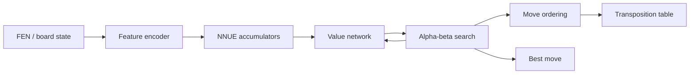

# SARDINE Blueprint

***S**mall **A**rtificial **R**AM-restricted **D**eep **I**ntelligent **N**eural **E**ngine*

A modular chess engine plan for the Wio Terminal. Each section lists **options** — pick one per row in the [Decision Log](#decision-log) at the bottom.

Sources: [Ideas 💡.md](Ideas%20💡.md), [NNUE.md](NNUE.md), [Models.md](Models.md), [FIDE Challenge](FIDE%20%26%20Google%20Efficient%20Chess%20AI%20Challenge.md), [Performance.md](Performance.md), `piece_count_distribution_10k.xlsx`.

---

## Mission

Build a complete, playable chess bot on the Wio Terminal that maximizes **Elo per byte** under hard flash and RAM limits — neural evaluation + shallow search, no cloud, no GPU.

**Non-goals (for v1):** human-like play emulation, full-strength Stockfish parity, photo/voice input.

---

## Hardware Constraints

| Resource | Wio Terminal | Implication |
|----------|--------------|-------------|
| CPU | SAMD51 @ 120 MHz, Cortex-M4F | No SIMD like x86; FPU available but flash stalls dominate |
| RAM | 192 KB | TT + search stack + accumulators must fit; no MB-scale tables |
| Flash | ~508 KB usable | Weights in PROGMEM; sketch ~60 KB overhead ([Performance.md](Performance.md)) |
| Bottleneck | `pgm_read_byte` | Wider nets → slower evals; sparse input helps L1 only |

**Design principle from Ideas:** store strength in **optimized weights**, not bloated search code (linrock / FIDE 1st place lesson).

---

## System Overview

---

## 1. Engine Runtime & Language

| ID | Option | Description | Pros | Cons |
|----|--------|-------------|------|------|
| **R-A** | **C on Wio (Cfish-style port)** | Rewrite engine core in C; minimal libc footprint | Lowest RAM overhead; FIDE winners used Cfish; more room for TT | Greenfield rewrite; no Arduino C++ ecosystem |
| **R-B** | **C++ Arduino (current path)** | Extend `Wio_TinyValueTest` sketch modularly | Already working; TFT/Serial; export pipeline wired | Higher binary overhead than pure C |
| **R-C** | **Hybrid: C search core + C++ glue** | Search + NNUE in `.c`; board UI in `.cpp` | Best of both if flash budget allows dual compilation | Build complexity |

**From Ideas:** C instead of C++ is "probably a must" for competitive efficiency; R-B is the pragmatic v0 if time is short.

---

## 2. Input Features / Board Encoding

| ID | Option | Description | Active features | Notes |
|----|--------|-------------|-----------------|-------|
| **F-A** | **Basic 768** | `(piece, square, color)` binary — standard NNUE | ~32 / 768 | Already in [featurizer.py](../src/tinymlinternship/datasets/featurizer.py) |
| **F-B** | **Pruned 704** | Zero impossible pawn ranks + mirrored king coords | ~32 / 704 | FIDE 2nd place; better compression ([Ideas 💡.md](Ideas%20💡.md)) |
| **F-C** | **HalfKP** | King-relative piece features; sparse, bucketed by king square | ~0.1% active | Best eval quality; complex incremental update on MCU |
| **F-D** | **24-plane dense** | Planes for transformer / CNN path (`8×8×24`) | 64 tokens × 24 | For non-NNUE architectures only |

**From Ideas:** simplified representation "probably doesn't make a big difference" in practice — F-A vs F-B is a compression win, not a strength win.

---

## 3. Evaluation Network

| ID      | Option                    | Architecture                                                          | Params (approx.)    | Flash (int8) | Wio latency (est.)                             |
| ------- | ------------------------- | --------------------------------------------------------------------- | ------------------- | ------------ | ---------------------------------------------- |
| **E-A** | **Nano MLP (status quo)** | `768→16→8→1`                                                          | ~13K                | ~14%         | 1.4 ms — [Performance.md](Performance.md)      |
| **E-B** | **Small MLP**             | `768→64→32→1`                                                         | ~56K                | ~22%         | 5.8 ms                                         |
| **E-C** | **Micro NNUE**            | `768→16→1` dual-perspective                                           | ~25K + accumulators | ~15%         | TBD (incremental L1)                           |
| **E-D** | **Compact NNUE**          | `768→64→1` dual-perspective                                           | ~100K               | ~25%         | TBD                                            |
| **E-E** | **Bucketed NNUE**         | E-C/E-D + 8 output weight sets                                        | +8× output layer    | +1–2%        | Specializes midgame vs endgame                 |
| **E-F** | **MOE conditional**       | Switch eval head by `inCheck` / capture threat                        | Small per-mode nets | Variable     | Ideas note: may break accumulator reuse        |
| **E-G** | **Transformer ~210K**     | 2-block policy+value — [chess transformer.md](chess%20transformer.md) | ~210K               | ~42%         | Likely 10–30 ms (full forward, no incremental) |
| **E-H** | **HCE only**              | Hand-crafted eval, no NN                                              | ~0 weights          | TT-heavy     | Fast nodes; weaker eval (FIDE 5th place path)  |

**From Ideas:** no HCE — neural eval only. NNUE + pre-computed patterns (geometric zeros) is the preferred direction.

**Rejected:** split policy into piece-picker + square-picker nets (saves trivial output FLOPs, doubles backbone cost).

---

## 4. Output Buckets (Evaluation Specialization)

Piece-count distribution from 10k Lichess games (`piece_count_distribution_10k.xlsx`): heavily skewed toward 28–32 pieces (~48% of positions); mean **23.4**.

| ID      | Option                             | Bucket scheme                                                                                                     | Rationale                                                 |
| ------- | ---------------------------------- | ----------------------------------------------------------------------------------------------------------------- | --------------------------------------------------------- |
| **B-A** | **None**                           | Single output layer                                                                                               | Simplest; no bucket selection overhead                    |
| **B-B** | **FIDE linear**                    | `bucket = (piece_count − 2) / 4` → 8 buckets                                                                      | Proven (Approvers 2nd); uneven position counts per bucket |
| **B-C** | **Balanced buckets (Ideas twist)** | Equalized training mass per bucket: 0: 2–12, 1: 13–17, 2: 18–21, 3: 22–24, 4: 25–27, 5: 28–29, 6: 30–31, 7: 32 | Better coverage of rare endgames                          |
| **B-D** | **MOE tactical**                   | Separate heads for `inCheck`, capture-or-promotion                                                                | nagiss / Noggenfogger style; complicates accumulators     |

**Selection note:** B-C needs dataset stratification during training; B-B is easier to implement.

---

## 5. Policy / Move Selection

NNUE has no native policy head. Options for how the bot chooses moves:

| ID      | Option                              | Mechanism                                                               | Needs policy net?            | Strength vs cost                                       |
| ------- | ----------------------------------- | ----------------------------------------------------------------------- | ---------------------------- | ------------------------------------------------------ |
| **P-A** | **Search-only**                     | Alpha-beta; eval at leaf nodes; 1-ply move ordering (captures, MVV-LVA) | No                           | Weakest move quality; simplest                         |
| **P-B** | **Search + history heuristics**     | Killer moves, countermove history (compressed)                          | No                           | FIDE 9th place (+30 Elo from SPSA on heuristics alone) |
| **P-C** | **Dual-head net (AlphaZero-style)** | Shared backbone → policy 2048/4096 + value 1                            | Yes (~same backbone as eval) | Best single-net design; backbone cost dominates        |
| **P-D** | **Imported HF policy**              | chess-bot / chess-alphazero-openenv checkpoint                          | Yes (9–10M params)           | Too large for Wio flash                                |
| **P-E** | **MCTS + value net**                | Monte Carlo tree search over value net                                  | Value only                   | Very slow on MCU; Ideas listed as open question        |
| **P-F** | **Policy ordering + search**        | Small policy head suggests move order; search decides                   | Light policy head            | Good compromise if P-C backbone is too heavy           |

**From Ideas:** AlphaZero dual-head "maybe too heavy" on Wio; P-A → P-B → P-F is a realistic ladder.

---

## 6. Incremental NNUE Updates

Only relevant if **E-C / E-D / E-E** selected.

| ID      | Option                        | Update strategy                                     | When to use                                   |
| ------- | ----------------------------- | --------------------------------------------------- | --------------------------------------------- |
| **U-A** | **Full recompute**            | Rebuild accumulator from scratch each eval          | Prototyping; no search yet (current Wio path) |
| **U-B** | **Add/sub incremental**       | `acc -= w[e2]; acc += w[e4]` per quiet move         | Standard NNUE; required for search speed      |
| **U-C** | **Lazy updates**              | Defer refresh until eval called; dirty flag per ply | TT cutoffs skip eval — big win with search    |
| **U-D** | **Copy-make + fused add/sub** | Store accumulator per ply; merge add/sub loops      | FIDE engines; pairs with U-C                  |

**From Ideas:** accumulator add/sub on move is core NNUE advantage.

**Caveat:** Horizontal king mirroring (K-A) forces full refresh when king crosses centre file.

---

## 7. Geometric Optimizations

| ID      | Option                        | Technique                                      | Flash savings                   | Runtime cost                    |
| ------- | ----------------------------- | ---------------------------------------------- | ------------------------------- | ------------------------------- |
| **K-A** | **Horizontal king mirroring** | King always on left half; flip board otherwise | ~2× king input compressibility  | Full refresh on centre crossing |
| **K-B** | **Zero impossible weights**   | Pawns on rank 1/8 weights hard-zeroed          | Better gzip + int8 sparsity     | None at runtime                 |
| **K-C** | **Magnitude pruning**         | Zero smallest 80% of weights post-training     | Already in `wio_int8_common.py` | None                            |
| **K-D** | **None**                      | Ship trained weights as-is                     | —                               | —                               |

---

## 8. Activation & Quantization

| ID      | Option                                        | Details                         | MCU fit                                          |
| ------- | --------------------------------------------- | ------------------------------- | ------------------------------------------------ |
| **Q-A** | **int8 weights + int16 accumulators + CReLU** | Standard NNUE deploy path       | Easy; matches existing export                    |
| **Q-B** | **int8 + SCReLU**                             | `clamp(x,0,1)²` — stronger eval | Needs careful int math; FIDE top nets            |
| **Q-C** | **float32 (current Wio)**                     | Dequant in forward loop         | Works; 4× flash vs int8; no speed gain on SAMD51 |
| Q-D     | int8 weights, tanh activation              | int8 lookup table               |                                                  |

---

## 9. Search Algorithm

| ID | Option | Features | RAM cost | Expected depth @ 100ms |
|----|--------|----------|----------|------------------------|
| **S-A** | **Negamax fixed depth** | No extensions, no pruning | Minimal stack | ~3–4 ply + eval cost |
| **S-B** | **Alpha-beta + quiescence** | Capture extensions at horizon | Low | +tactical stability |
| **S-C** | **+ LMR + NMP** | Late Move Reductions, Null Move Pruning | Medium | FIDE stripped search recipe |
| **S-D** | **Iterative deepening + aspiration** | Time-managed depth | TT-dependent | Best strength per time budget |

**From Ideas:** aggressive LMR + NMP calibrated for weaker micro-net eval.

**Overhead model (from PROJECT.md):** `total_cost ≈ overhead + cost_per_node × nodes`.

---

## 10. Memory Budget

Total flash ~508 KB; RAM 192 KB. Two allocation philosophies:

### Flash (weights + code)

| ID       | Split                        | Weights                                     | Search code + tables | History        |
| -------- | ---------------------------- | ------------------------------------------- | -------------------- | -------------- |
| **M-F1** | **Eval-heavy**               | 45%                                         | 40%                  | 15%            |
| **M-F2** | **Balanced (SARDINE draft)** | 10%                                         | 70% TT in RAM*       | 5% algo policy |
| **M-F3** | **Reuse nano→huge sweep**    | 14–96% per [Performance.md](Performance.md) | remainder            | —              |

*TT lives in RAM, not flash — see RAM table.

### RAM (runtime)

| ID | Split | TT | Accumulators + stack | Scratch | Free margin |
|----|-------|----|-----------------------|---------|-------------|
| **M-R1** | **TT-dominant (FIDE)** | 128–160 KB | 16 KB | 16 KB | ~0–32 KB |
| **M-R2** | **Eval-dominant** | 64 KB | 32 KB (dual acc + search) | 16 KB | ~80 KB |
| **M-R3** | **No TT (v0)** | 0 | 8 KB | 16 KB | ~168 KB — eval-only bot |

**FIDE lesson:** 512 KiB–1 MiB TT on 5 MiB RAM → on Wio, TT must be **much** smaller; M-R1 may only fit 2–8K entries.

---

## 11. Move Ordering (non-neural)

| ID | Option | Tables | Size estimate |
|----|--------|--------|---------------|
| **O-A** | **MVV-LVA + captures first** | None | 0 |
| **O-B** | **Killer moves** | 2 per ply × depth | ~1 KB |
| **O-C** | **Countermove history (compressed)** | Piece-type indexed, collapsed branches | ~2–4 KB |
| **O-D** | **Full history (FIDE 9th pre-gutting)** | Larger but tunable via SPSA | 8+ KB |

---

## 12. Training Data

| ID | Option | Source | Filtering |
|----|--------|--------|-----------|
| **D-A** | **Kaggle `games.csv`** | Already in `data/raw/` | Random sample; quick iteration |
| **D-B** | **Lc0 high-quality games** | Leela training data | Ideas: flatten piece-count curve; skip first 28 plies; keep sacrifice positions (linrock) |
| **D-C** | **Stockfish self-play** | Generate labels with SF at depth N | Slow to produce; best eval targets |
| **D-D** | **Bucket-stratified (for B-C)** | D-A or D-B | Resample to equalize [Ideas bucket table](Ideas%20💡.md) |

**Piece-count prior:** when training without stratification, ~48% of positions have 28–32 pieces — network will be middlegame-biased.

---

## 13. Training & Tuning Pipeline

| ID | Option | Tooling | Stage |
|----|--------|---------|-------|
| **T-A** | **Custom PyTorch** | Extend `wio_int8_common.py` train loop | Quick sanity train on CSV |
| **T-B** | **nnue-pytorch** | [Stockfish trainer](https://github.com/official-stockfish/nnue-pytorch) | Proper NNUE if E-C/D selected |
| **T-C** | **Grapheus** | Low-memory NNUE training configs | FIDE 3rd place |
| **T-D** | **SPSA post-hoc** | Custom script + `cutechess-cli` | Tune search/heuristic weights without retraining net (+30 Elo possible) |
| **T-E** | **Distillation** | Teacher: HF chess-bot or Stockfish eval | Compress knowledge into micro-net |

**From Ideas:** SPSA and Grapheus are optional accelerants, not blockers.

---

## 14. Deployment & I/O

| ID | Option | Input | Output |
|----|--------|-------|--------|
| **I-A** | **Serial FEN in / move UCI out** | USB serial | Debug-first; no UI |
| **I-B** | **TFT + Serial (current)** | Hardcoded or serial FEN | Show eval + evals/s on LCD |
| **I-C** | **On-device move input** | Button/grid UI on Wio | Full standalone product |

---

## 15. Build Phases (recommended order)

Independent of component choices, this is the integration sequence:

1. **Freeze decisions** — fill Decision Log below
2. **Feature encoder** — F-A or F-B on PC + parity with device
3. **Eval net v0** — train + int8 export + Wio benchmark (extend existing nano path)
4. **Eval net v1** — add buckets (B-*), geometric opts (K-*), incremental updates (U-B)
5. **Search skeleton** — S-A on PC, then port; measure `cost_per_node`
6. **Search strength** — S-B → S-C; move ordering O-B/O-C; TT (M-R1 or M-R2)
7. **Tuning** — SPSA (T-D) on search params; optional Grapheus retrain
8. **Elo gate** — bot vs fixed-strength baseline (PROJECT.md milestone)
9. **Power profile** — OTII measurement per move ([hardware.md](hardware.md))

---

## Reference Configurations (presets)

Short bundles if you want a starting point before mixing options:

| Preset | Eval | Policy | Search | Memory | Philosophy |
|--------|------|--------|--------|--------|------------|
| **Sardine MIN** | E-A | P-A | S-A | M-R3 | Eval-only demo; ship fast |
| **Sardine NNUE** | E-C + B-C + K-B | P-B | S-C | M-R2 | Ideas-aligned; best Elo/byte target |
| **Sardine Transformer** | E-G | P-C | S-A | M-F3 (small tier) | Research path; likely too slow for deep search |
| **Sardine FIDE** | E-E + K-A + Q-B | P-B | S-C + O-D | M-R1 | Maximum strength; hardest build |

---

## Decision Log

*Locked 2026-06-30. One ID per row; combined options spelled out explicitly.*

| Component                | Selected                    | Notes                                                                                                                                                                                    |
| ------------------------ | --------------------------- | ---------------------------------------------------------------------------------------------------------------------------------------------------------------------------------------- |
| Runtime (§1)             | **R-A**                     | Pure C engine core (Cfish-style). TFT/Serial glue can stay minimal C++ only if Arduino toolchain requires it → see R-C fallback.                                                         |
| Features (§2)            | **F-B**                     | Pruned 704. HalfKP (**F-C**) deferred — only worth it after incremental NNUE works.                                                                                                      |
| Evaluation (§3)          | **E-E (E-C)**               | Bucketed micro NNUE `768→16→1` + 8 output sets. Not **E-F** (tactical MoE) — piece-count specialization is already **B-C**.                                                              |
| Output buckets (§4)      | **B-C**                     | Balanced training buckets (Ideas twist). Requires **D-D** stratification.                                                                                                                |
| Policy (§5)              | **P-A**                     | Search-only for v1. Upgrade to **P-B** once history tables are in.                                                                                                                       |
| Incremental updates (§6) | **U-B** → **U-C**           | Add/sub first; add lazy updates when TT cutoffs matter. **U-D** optional with copy-make.                                                                                                 |
| Geometric opts (§7)      | **K-A, K-B, K-C**           | Mirroring + zero impossible weights + magnitude pruning.                                                                                                                                 |
| Quantization (§8)        | **Q-A**                     | int8 + int16 accumulators + CReLU — native NNUE path. **Q-D** (tanh LUT) fits MLP eval, not NNUE accumulators.                                                                           |
| Search (§9)              | **S-B** → **S-C** → **S-D** | Quiescence first, then LMR+NMP, then iterative deepening once TT is stable.                                                                                                              |
| Flash budget (§10)       | **M-F2**                    | ~10% flash for weights; majority of code budget for search + tables.                                                                                                                     |
| RAM budget (§10)         | **M-R1**                    | TT-dominant (128–160 KB). Pairs with **S-D** and **P-B** later.                                                                                                                          |
| Move ordering (§11)      | **O-A** → **O-B**           | MVV-LVA + captures for v1; killer moves when search depth > 4.                                                                                                                           |
| Training data (§12)      | **D-B + D-D**               | Lc0 primary; bucket-stratified resampling for **B-C**. **D-C** (Stockfish) optional augment if labels need boost.                                                                        |
| Training pipeline (§13)  | **T-B** + **T-D**           | nnue-pytorch for net; SPSA post-hoc for search/heuristic tuning.                                                                                                                         |
| I/O (§14)                | **I-B**                     | TFT + Serial; hardcoded FEN input for now (no **I-C** UI yet).                                                                                                                           |
| Preset (optional)        | —                           | Custom hybrid: FIDE memory (**M-R1**) + micro NNUE (**E-E**) + v1 search ladder (**P-A**, **S-B**). Closest preset: **Sardine NNUE**, but with **R-A** and **M-R1** instead of **M-R2**. |

---

## Open Questions

- [ ] Target Elo / opponent for acceptance test?
- [ ] Time control on Wio (ms per move budget)?
- [ ] Is MCTS (P-E) ever viable at 120 MHz, or ruled out for v1?
- [ ] Port to C (R-A) before or after first playable search in C++?
- [ ] Dual-head: share backbone with NNUE accumulator or separate nets?

---

[← Back to Notes index](_notes.md)