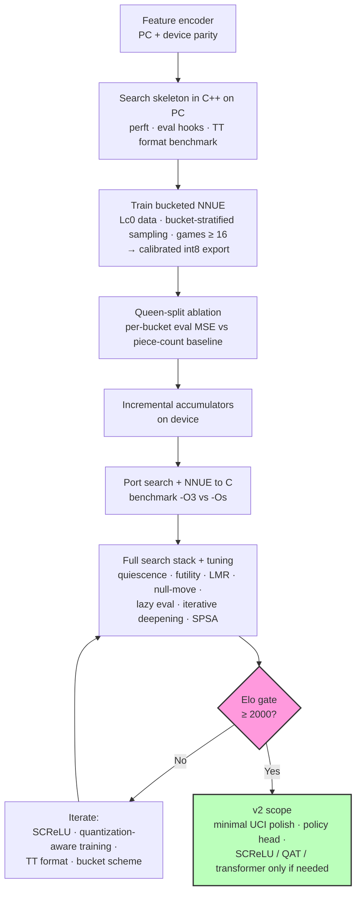
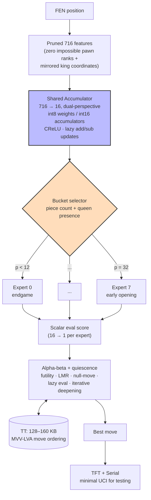

# SARDINE

Chess engine for the **Wio Terminal** — neural evaluation + alpha-beta search, maximizing **Elo per byte** under 192 KB RAM / ~500 KB flash.

*Alternative designs considered: [SARDINE design options.md](SARDINE%20design%20options.md).*

---

## Mission

> Playable chess bot on a tiny device: no cloud, no GPU. Extreme optimization and efficiency. 

---

## Targets

| Parameter     | Decision                                                                                 |
| ------------- | ---------------------------------------------------------------------------------------- |
| **Elo**       | ≥ **2000** (reference: FIDE Kaggle bots ~2500 Elo at 5 MiB RAM)                          |
| **Move time** | Best move within **~1 s**                                                                |
| **MCTS**      | Feasible on-device (1–50 ms/eval); **v2 only** — v1 uses alpha-beta                      |
| **Nets**      | **Separate nets** — NNUE for eval; distinct policy head deferred until after v1 Elo gate |

**Node budget reference:** Urusov's ESP32 engine (~20 kNps, heuristics-only, ~2023 Elo) sets a baseline for search throughput without NNUE. SARDINE's reachable depth in ~1 s depends on measured eval latency + move-gen overhead on Wio — model empirically once the search skeleton exists (see Open Questions).

---

## Build Pipeline

---

## MoE + NNUE Architecture

The accumulator (blue) is computed once per position and shared across all 8 experts — only the output head selected by the bucket router (orange) changes. Incremental add/sub updates on the accumulator are bucket-agnostic.

---

## Design Decisions

### Runtime (phased)

Pure **C** engine core (Cfish-style) is the target, but **port after** the first playable search exists in C++ on PC.

Rationale: debugging alpha-beta, quiescence, and TT interactions is far faster with a PC toolchain (debugger, sanitizers, perft/eval unit tests) than on Wio hardware. Minimal C++ remains acceptable for TFT/Serial glue on-device.

**Compiler flags:** once the C port lands (build step 6), benchmark `-O3` vs `-Os` on Wio — a free recompile experiment; no decision needed upfront. FIDE 9th place gained significant speed from `-O3` after gutting unused features.

**MicroChess bare-metal patterns:** skip — not worth diverging from a standard alpha-beta skeleton for v1.

---

### Input features

**Pruned 716** features: zero impossible pawn ranks + mirrored king coordinates. HalfKP deferred.

Input structure:

$$6 \times 2 \times 64 - 2\times16 - 32 + 4 + 8 = 716$$

- $6\times2\times64 = 716$ (piece types × colors × squares)
- $-2\times16 = -32$ (pawn rank pruning: 2 colors × 16 illegal squares)
- $-32$ (king mirroring: one king plane 64→32)
- $+4$ (castling rights)
- $+8$ (en passant file)

**Separate pattern tables:** skip for v1. Geometric zeros (impossible pawn ranks, king mirroring, magnitude pruning) already capture the cheapest compression wins; a handcrafted pattern cache adds flash complexity for uncertain gain until the Elo gap is measured.

---

### Evaluation

**Bucketed micro NNUE:** `716 → 16 → 1`, dual-perspective, **8 output weight sets** (experts) selected by position bucket.

**Shared accumulator:** all experts share the same first hidden layer. The accumulator depends only on board features, not on which output bucket is active — compute it once per position, then route to the correct output head. Matches Stockfish-style bucketed NNUE; incremental add/sub updates stay bucket-agnostic.

**Autoencoder warm-start:** skip for v1.

**Tactical MoE (`inCheck`, capture threat):** defer to v1.x/v2. Bucket switches are already infrequent along a typical game (piece count mostly decreases), so the current 8-bucket scheme is not leaving large gains on the table — no urgency to add tactical heads earlier.

---

### Output buckets

Balanced training buckets (based on number of pieces $p$, kings included) with **queen-split** (for now) in middlegame/opening bands:

| Bucket | Condition                      | Phase           |
| ------ | ------------------------------ | --------------- |
| 0      | $p \le 12$                     | endgame         |
| 1      | $p \in [13,21]$, no queen      | late middlegame |
| 2      | $p \in [13,21]$, queen present | late middlegame |
| 3      | $p \in [22,27]$, no queen      | middlegame      |
| 4      | $p \in [22,27]$, queen present | middlegame      |
| 5      | $p \in [28,31]$, no queen      | opening         |
| 6      | $p \in [28,31]$, queen present | opening         |
| 7      | $p = 32$                       | early opening   |

Queen presence is high-leverage in buckets 1–4. Buckets 0 and 7 barely need the split.

**Ablation plan:** train queen-split vs pure piece-count buckets once pipeline exists. Compare **per-bucket eval MSE** on a Stockfish-labeled validation set (stratified like training) — not pooled MSE alone. Escalate to playing-strength tests only if per-bucket results are ambiguous or contradictory.

Informed by `piece_count_distribution_10k.xlsx` (games ≥ 16 moves). Training uses bucket-stratified resampling.

---

### Policy (v1)

**Search-only** for v1. Add killer-move once tables are in.

**Policy guidance net (v2):** defer until after v1 Elo gate. Lightweight head off the **shared accumulator** (16 → move-ranking); watch per-node latency against the ~1 s budget.

**Compact transformer fallback:** the ~210K design in [chess transformer.md](chess%20transformer.md) stays in reserve — evaluate only if the lightweight policy head underperforms post-gate. Too heavy for per-node move ordering to pursue in parallel; last resort, not a parallel track.

***Killer moves** are a complementary heuristic for non-capture moves. The idea: if a particular quiet move (not a capture) caused a beta cutoff (i.e., it was so strong the search stopped exploring further alternatives at that depth) in one branch of the tree, it's often also a strong move in sibling branches at the same depth — even though the board position is slightly different. Chess tactics are often tied to squares and piece maneuvers rather than the exact position, so a move like "knight jumps to a strong central square" that worked well once tends to work well again nearby in the tree.*

---

### Incremental updates & lazy evaluation

1. **Add/sub** accumulator updates on each move (shared layer — bucket-independent)
2. **Lazy accumulator updates** — defer refresh until eval is actually needed (TT cutoffs skip work)
3. **Lazy evaluation** — skip full NNUE forward when a beta cutoff is already provable from a prior ply score; implement **together** with lazy accumulator updates (same "skip work when cutoff makes it moot" principle)
4. Copy-make + fused add/sub optional later

---

### Geometric optimizations

- Horizontal king mirroring
- Hard-zero weights for impossible states (pawns on rank 1/8)
- Magnitude pruning (~80% sparsity post-training)

---

### Quantization

| Tensor | Precision |
|--------|-----------|
| Weights | **int8** |
| Biases | **int16** |
| Accumulators | **int16** |
| Activation | **CReLU** (v1) |

**Scale calibration:** train fp32 first, histogram post-training weights, set per-tensor scales onto $[-127, 127]$ with minimal clipping.

**SCReLU fallback** — first upgrade if CReLU plateaus below ≥2000 Elo: clip before square (int16), multiply-accumulate in int32.

**Grapheus / quantization-aware training:** skip for v1. Stay on **nnue-pytorch** + calibrated post-training quantization; investigate QAT only if the fp32→int8 gap threatens the Elo gate.

---

### Search

Phased rollout:

1. Alpha-beta + **quiescence**
2. **Futility pruning** + **late-move reduction** + **null-move pruning** (futility is cheap, well-proven at this speed class — include in v1, not deferred)
3. **Lazy evaluation** (paired with lazy accumulator updates)
4. **Iterative deepening** once TT is stable

**Stack surfing (MicroChess-style dynamic depth):** rejected for v1. With TT already claiming 128–160 KB of 192 KB RAM, probing free stack at runtime to extend depth is too risky alongside accumulators and search stack.

**Fixed depth / iterative deepening** within the ~1 s budget replaces dynamic stack-based depth.

---

### Memory

| Resource | Philosophy | Allocation |
|----------|------------|------------|
| **Flash** | Balanced | ~10% weights; rest search code + tables; **no opening book v1** |
| **RAM** | TT-dominant | TT **128–160 KB**; accumulators + stack ~16 KB; scratch ~16 KB |

**Opening book:** defer until after Elo gate. Dog ships one, but flash is better spent on search + NNUE for v1.

**Dog (ESP32) reference:** Dog fits NNUE + TT + book in ~320 KB RAM at ~2000+ Elo on-device — proof the target is feasible. RAM layout study still useful (see Open Questions) but TT-dominant plan stands.

#### Transposition table

Design entry format first; slot count follows from 128–160 KB budget. Prototype on PC (build step 2), then benchmark on **Wio**.

**Candidate entry:** truncated zobrist, best move (~16 bit), score (16 bit), depth (8 bit), bound type (2 bit).

| Format | Size | Slots @ 128 KB | Trade-off |
|--------|------|----------------|-----------|
| Tight pack | ~10 B | ~13,100 | More entries; unaligned loads on SAMD51 cost extra shift/merge per probe |
| Byte-aligned | 16 B | ~8,200 | Fewer entries; faster probes |

**Decision metric:** wall-clock **nodes/sec** and **depth reached in ~1 s** on Wio — not hit-rate alone.

---

### Move ordering

**MVV-LVA + captures** for v1; **killer moves** when search depth > 4.

***Move ordering** is about the order in which a chess engine tries moves at each node in the search tree — not which moves are legal, but which ones get examined first. This matters enormously because of alpha-beta pruning: alpha-beta can skip whole branches of the search tree once it proves a move is "good enough" that the opponent would never let you reach it, but how much it can skip depends entirely on whether the best moves get searched early. If you search the best move first, alpha-beta prunes aggressively and the search is fast. If you search it last, you've wasted time fully exploring worse alternatives before finding it, and pruning barely helps. Good move ordering can be the difference between searching a few thousand nodes and a few million to reach the same depth.*

---

### Training data

- Primary: **Lc0** high-quality games
- **Games ≥ 16 moves** (consistent with distribution analysis)
- **Bucket-stratified** resampling (queen-split rules)
- Stockfish self-play labels optional augment

---

### Training pipeline

- **nnue-pytorch** for v1 network training (not Grapheus)
- Calibrated post-training int8 export; measure fp32→int8 gap before considering QAT
- **SPSA** post-hoc for search/heuristic tuning

---

### I/O

**TFT + Serial** for on-device display and debug output.

**Minimal UCI over Serial:** yes — required for standardized Elo testing against the ≥2000 gate. Full UCI spec not needed; implement enough of the protocol for engine-vs-engine tools (cutechess-cli, etc.). Hardcoded FEN remains fine for early bring-up; UCI lands before or during Elo gate testing.

*TFT = Thin-Film Transistor LCD on the Wio Terminal (2.4" onboard screen).*

---
