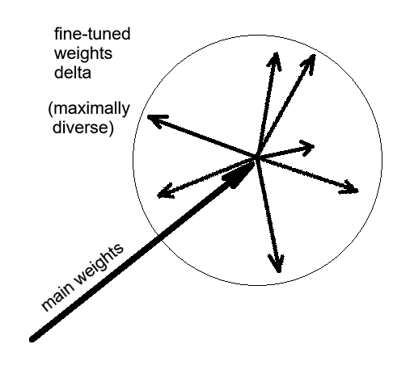
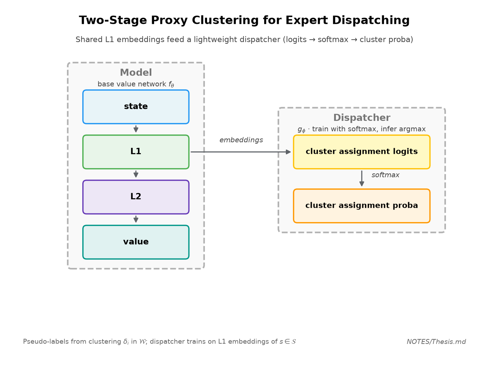

> *Relatore: Alessio Ansuini* 

---
 
## Idee con il prof. Ansuini

"Task vectors (in weight space / representation space) T1, T2, …, T8 have specific vectors in the weight space. Is it possible / useful to define task vectors that bring you from one head to another with minimal information/performance loss? This may be the case if the head vectors live in a linear submanifold of low dimensionality (are we so lucky? Maybe not!)"

[Task vectors](https://arxiv.org/abs/2212.04089), "distance between layers" in parameter space (permutations!), [The Lottery Ticket Hypothesis](https://arxiv.org/abs/1803.03635)

## Finding Optimal Feature Combinations for Maximally-Diverse Experts

Basically, what I will try next is the following: training of a single NNUE (L1 + L2 + Output layer), then fine-tune the L2 and Output layers for every head, but with a twist; find a set of features of the board states (number of pieces, queen or no queen, bishop pair, rook pair, king position, ... `-> (30/32, 1, 0, 1, 5/8, 1/8, ...)` etc...). We re-do the fine-tuning on various combinations of features to obtain various **normalized delta vectors** (after minus before fine-tuning). We pick the sets of partitions

    

Be careful: tiling of the position space must be complete and with no overlaps (like a function $g_\phi : s_{board} \rightarrow i_{bucket}$) , and the bucket must probably be of (more or less) uniform size.

bucket i = set of all board states in the database with index $g_\phi(s)==i$

expert model i trained on bucket i (**one sweep**) produces a delta vector. 

Score for f = some sort of average angular distance (**cosine similarity**) between delta vectors, but very low if the smallest distance is small.

Note: the deltas should point in all directions by default. If they don't, the training was probably not complete.

---

## Notation

The dataset is composed of state-value pairs $(s_i, v_i)$ 
States live in state space $\mathcal S$
Values live in value space, $[-1, 1]$ in this case.

Base model $f_\theta$ , where $\theta = (W_{L1}, W_{L2}, W_{\text{out}})$ and $w = (W_{L2}, W_{\text{out}})$ 
Weights $w$ live in weight space $\mathcal W$
**Freeze L1 weights** $W_{L1}$ (shared representation fixed), and only the $w$ weights are free.

Number of buckets/experts $B$ 
**Bucket function** $g_\phi : \mathcal{S} \rightarrow \{1, 2, \dots, B\}$ where:
Partitioning $\mathcal{D}=\{\mathcal{D}_1​,\mathcal{D}_2​,…,\mathcal{D}_B​\}$ given by $g_\phi$, used interchangeably as either an actual partitioning, or a product of probabilities.

Distance $d(\delta_i, \delta_j)$ , for example, the cosine similarity $d(\delta_i, \delta_j) = 1 - \frac{\delta_i \; \cdot \; \delta_j}{\|\delta_i\| \, \| \delta_j \|}$
Diversity metric $S(\mathcal{D})$, for example intra-cluster distance between centroid $c_i$
$$S(\mathcal{D}) = \frac{1}{\binom{B}{2}} \sum_{i<j} d(c_i, c_j)$$
Task vectors $\delta_i = \nabla_w \; \mathcal L_{acc}(f_\theta(s_{i}), v_i)$ live in weight space $\mathcal W$

---

**Candidate input features for $g$:** the entire board, piece count, king location, queen presence, bishop/rook pair, material imbalance, pawn structure, mobility, etc. Search over combinations (greedy / random / GA) rather than exhaustive enumeration.

Insight: of course, clustering alone isn't enough because we need to train a dispatcher that can assign the positions to the right buckets.

**==Important idea for the thesis== (Omar + Ansuini):** freeze shared L1 from a single base value function model $f_\theta$; for each candidate partition $g_\phi : s_{\mathrm{board}} \mapsto i_{\mathrm{bucket}}$ , fine-tune only L2 + output **one sweep** per bucket and record normalized **delta (task) vectors** $\delta_i = \theta_i - \theta_{\mathrm{base}}$ (fine-tuned layers only). Score $f_\theta$ by how **diverse** the $\delta_i$ are (mean angular distance / cosine, with a penalty if any pair is nearly collinear). Partition must be **complete and non-overlapping**, buckets roughly uniform in sample count.

==**Idea**==: Alternatively, perform one sweep of the dataset of $(s_i, v_i)$ pairs to compute (once) the deltas $\delta_i = \nabla_w \; \mathcal L_{acc}(f_\theta(s_{i}), v_i)$ , defined as the gradient of the loss wrt the value function weights. Then, train a dispatcher $g_\phi(s_{board})$ (FFNN, no hidden layer, softmax activation) to partition the dataset so to maximize the average intra-cluster distance $S$ (minus the average within-cluster distance). The point is to have a simple dispatcher that is optimized to group board positions in maximally-diverse clusters. 
The probabilistic nature of the softmax makes the training possible, but during inference we get rid of that block, and only pick the highest-value activation to assign the class (same result but faster). ==Importantly==, however, the gradienti of the dispatcher $\nabla_\phi \, S(\mathcal D)$ cannot be computed exactly, as it requires a sum over all possible partitions $\mathcal D$, and therefore it has to be approximated.

**==Candidate solution==**: In a way, we have to perform clustering in weight space $\mathcal W$, but the bucketing function can only see the state space $\mathcal S$. Would the following simple approach make sense? 
1. Perform clustering in value space 
2. Train a classifier in state-space based on the clustering 
Take the trained classifier at face value. It's not perfect, but should do the job, which is to *have a function that distinguishes between maximally diverse board states*. 
If we want to be fancy, instead of working directly in state space, we work on a lower-dimentional embedding space instead. For instance, we can use the L1 layer.

---

### Proposed Solution: Two-Stage Proxy Clustering for Expert Dispatching

**Objective** To construct a dispatcher function $g_\phi$ that partitions the state space $\mathcal{S}$ into $B$ discrete buckets, maximizing the divergence of the resulting task vectors in the weight space $\mathcal{W}$. Because the dispatcher can only observe $\mathcal{S}$ while the optimization target resides in $\mathcal{W}$, computing the exact gradient $\nabla_\phi \, S(\mathcal{D})$ is intractable. To bypass this, we propose a decoupled, two-step heuristic.

**Methodology**

- **Step 1: Clustering the Task Vectors** - We first compute the instance-specific task vectors $\delta_i = \nabla_w \; \mathcal{L}_{acc}(f_\theta(s_i), v_i)$ for each data point. Then, by **clustering** them, we generate a set of pseudo-labels, a partition $\mathcal D$ that explicitly groups the board states into maximally diverse clusters.
    
- **Step 2: Training the Dispatcher** - We then train a separate, **lightweight** classifier $g_\phi$ to predict these generated cluster assignments. To improve generalization and reduce computational overhead, $g_\phi$ will not operate on the raw, high-dimensional state space $\mathcal{S}$. Instead, we will map the inputs to a lower-dimensional embedding space, specifically utilizing the activations from the base model's frozen L1 layer as the input features for the dispatcher.

    

**Inference**: 
1. Compute the sparse binary representation of the board state
2. Forward pass on L1
3. Pass the activations to the *cluster assignment logits block* (no need for the softmax block)
4. Argmax on the logits to select the appropriate **expert head**
5. Forward pass on the expert head (L2 + value)

**Conclusion** This approach successfully decouples the weight-space clustering objective from the state-space routing mechanism. Taking the trained classifier at face value yields a highly functional dispatcher capable of assigning board positions to maximally diverse expert models without requiring end-to-end differentiable clustering.

---
