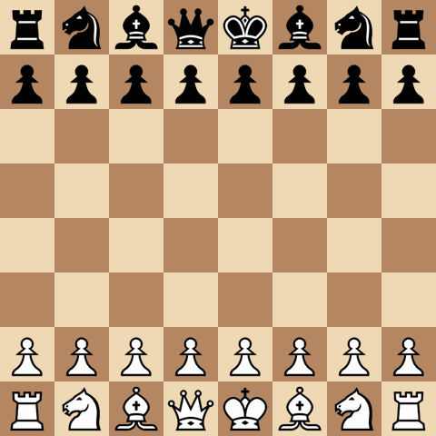

# DSAI Internship - Chess AI on TinyML


> *I am developing an end-to-end pipeline that optimizes a given chess engine based on specific hardware constraints. By applying compression techniques such as pruning and quantization, the framework aims to significantly reduce the model's footprint while preserving its original playing performance.*

- Engine blueprint: [NOTES/SARDINE Engine Blueprint.md](NOTES/SARDINE%20Engine%20Blueprint.md)
- Online models: [NOTES/Models.md](NOTES/Models.md)
- Kaggle challenge: [FIDE & Google Efficient Chess AI Challenge](https://www.kaggle.com/competitions/fide-google-efficiency-chess-ai-challenge)
- Project details: [PROJECT.md](PROJECT.md)
- Internship report: [Project Report.md](Project%20Report.md)
- project notes: [NOTES/notes.md](_notes.md)
- pipeline assets: [ASSETS.md](ASSETS.md)

**Engine self-play demos (depth 2):**

| Eval | GIF |
|------|-----|
| Demo reel |  |
| HCE (no qsearch) |  |
| NNUE `pilot_W128_844` |  |

```bash
# Reproduce GIFs
pip install -e ".[viz]"
py -3.12 scripts/record_engine_game.py --eval hce --depth 2 --no-quiescence --headless --output images/hce_d2_game.gif
py -3.12 scripts/record_engine_game.py --eval nnue --depth 2 --headless --output images/nnue_d2_game.gif
```

---

## SARDINE Pipeline

**SARDINE** — *Small Artificial RAM-restricted Deep Intelligent Neural Engine* — is a Wio Terminal chess engine targeting **~1700 Elo** and **~1 s/move**, under **192 KB RAM** and **~500 KB flash**. Full spec: [NOTES/SARDINE Engine Blueprint.md](NOTES/SARDINE%20Engine%20Blueprint.md).

| Piece | Choice |
|-------|--------|
| **Eval (target)** | Bucketed micro NNUE: shared **844 → W** ($W \in \{128, 256\}$, dual POV) → concat **2W** → expert **2W → 1** (×8 buckets); CReLU hidden, **tanh LUT** → expected reward $[-1,+1]$; dense train + gradual prune 70–80% → sparse int8 |
| **Eval (now)** | **HCE** default; **NNUE** via `--eval nnue` (`evaluate_nnue`, checkpoint `pilot_W128_844/best.pt`) |
| **Search (v1)** | Alpha-beta + quiescence, futility, LMR, null-move, lazy eval, iterative deepening; MVV-LVA + killers (depth > 4) |
| **Search (now)** | **v0.3:** fixed-depth alpha-beta + capture quiescence, MVV-LVA ordering, perft d5 |
| **Teacher** | Lc0 **latest best network** (`expected_reward = W − L` via UCI WDL, on-the-fly) |
| **Training data** | **Lichess PGN** → FEN (natural bucket distribution) + Lc0 supplement; ChessBench test split = **smoke only** |
| **Training (target)** | **nnue-pytorch** (844-dim bucketed), 100 ep, PTQ → QAT fallback; gradual L1 prune in training |
| **Training (now)** | PyTorch pilot smoke — `scripts/train_nnue.py` on ChessBench parquet (`pilot_W128_844`) |
| **Runtime** | C engine core on device (after PC bring-up); TFT + Serial; minimal UCI for Elo testing |
| **RAM** | TT-dominant (**128–160 KB**); accumulators + stack ~16 KB |

**Build order:** feature encoder ✅ → search skeleton (partial ✅) → train bucketed NNUE (pilot ✅) → queen-split ablation → incremental accumulators → C port → full search + **Elo gate ≥ 1700**.

**Active code:** `src/tinymlinternship/features/` (844 encoder: 716 base + tactical 128), `src/tinymlinternship/engine/` (v0.3), `src/tinymlinternship/nnue/` (training), `src/tinymlinternship/data/` (Lc0 + ChessBench), `src/tinymlinternship/visualization/` (pygame + GIF). Scripts: `run_engine.py`, `record_engine_game.py`, `lichess_pgn_to_fen.py`, `label_positions.py`, `train_nnue.py`, `download_lc0.py`, `prepare_chessbench_dataset.py`. Legacy value-net → `legacy/pre-sardine/`.

**Train NNUE pilot (smoke only)** — not the production path; validates encoder + engine wiring (844-dim, ChessBench splits, W=128):

```bash
pip install -e ".[train]"
py -3.12 scripts/prepare_chessbench_dataset.py   # if parquet still 716-dim
py -3.12 scripts/train_nnue.py --epochs 10 --run-name pilot_W128_844
```

**Replay a self-play game as GIF** (writes `images/sardine_game.gif`):

```bash
pip install -e ".[viz]"
py -3.12 scripts/record_engine_game.py
```


See [NOTES/Commands.md](NOTES/Commands.md) for all commands.

---

#core