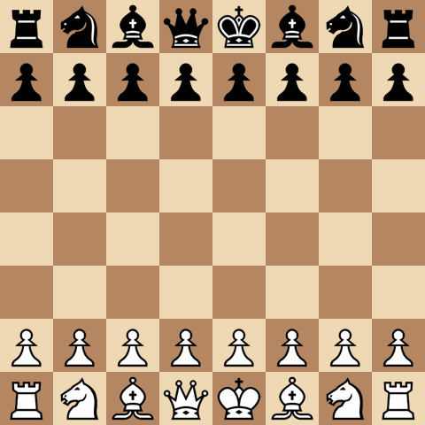

# DSAI Internship - Chess AI on TinyML


> *I am developing an end-to-end pipeline that optimizes a given chess engine based on specific hardware constraints. By applying compression techniques such as pruning and quantization, the framework aims to significantly reduce the model's footprint while preserving its original playing performance.*

- Engine blueprint: [NOTES/SARDINE Engine Blueprint.md](NOTES/SARDINE%20Engine%20Blueprint.md)
- Modelli online: [NOTES/Models.md](NOTES/Models.md)
- Kaggle challenge: [FIDE & Google Efficient Chess AI Challenge](NOTES/FIDE%20%26%20Google%20Efficient%20Chess%20AI%20Challenge.md)
- Dettagli progetto: [PROJECT.md](PROJECT.md)
- Report di tirocinio: [Project Report.md](Project%20Report.md)
- Note progetto: [NOTES/notes.md](_notes.md)
- Pre-SARDINE archive: [legacy/pre-sardine/](legacy/pre-sardine/)





---

## SARDINE Pipeline

**SARDINE** — *Small Artificial RAM-restricted Deep Intelligent Neural Engine* — is a Wio Terminal chess engine targeting **~1700 Elo** and **~1 s/move**, under **192 KB RAM** and **~500 KB flash**. Full spec: [NOTES/SARDINE Engine Blueprint.md](NOTES/SARDINE%20Engine%20Blueprint.md).

| Piece | Choice |
|-------|--------|
| **Eval (target)** | Bucketed micro NNUE: shared **716 → W** ($W \in \{128, 256\}$, dual POV) → concat **2W** → expert **2W → 1** (×8 buckets); CReLU hidden, **tanh LUT** → expected reward $[-1,+1]$; dense train → magnitude prune 70–80% → sparse int8 |
| **Eval (now)** | **HCE** in search (`evaluate_hce`); **NNUE pilot** trained (W=128, val_mse 0.058) — not yet wired into engine |
| **Search (v1)** | Alpha-beta + quiescence, futility, LMR, null-move, lazy eval, iterative deepening; MVV-LVA + killers (depth > 4) |
| **Search (now)** | **v0.3:** fixed-depth alpha-beta + capture quiescence, MVV-LVA ordering, perft d5 |
| **Teacher** | Lc0 BT4 (`expected_reward = W − L`); ChessBench SF16 `win_prob` for training labels |
| **Training data** | ChessBench test split (62k pos, pre-labeled) + Lc0 subset (~1–2 GB, bucket-stratified); Lichess human games planned |
| **Training (now)** | PyTorch `BucketedNNUE` + `scripts/train_nnue.py`; int8 export + tanh LUT pending |
| **Runtime** | C engine core on device (after PC bring-up); TFT + Serial; minimal UCI for Elo testing |
| **RAM** | TT-dominant (**128–160 KB**); accumulators + stack ~16 KB |

**Build order:** feature encoder ✅ → search skeleton (partial ✅) → train bucketed NNUE (pilot ✅) → queen-split ablation → incremental accumulators → C port → full search + **Elo gate ≥ 1700**.

**Active code:** `src/tinymlinternship/features/` (716 encoder), `src/tinymlinternship/engine/` (v0.3), `src/tinymlinternship/nnue/` (training), `src/tinymlinternship/data/` (Lc0 + ChessBench), `src/tinymlinternship/visualization/` (pygame + GIF). Scripts: `run_engine.py`, `record_engine_game.py`, `train_nnue.py`, `download_lc0.py`, `prepare_chessbench_dataset.py`. Legacy value-net → `legacy/pre-sardine/`.

**Train NNUE pilot** (ChessBench splits, W=128):

```bash
pip install -e ".[train]"
py -3.12 scripts/train_nnue.py --epochs 10 --run-name pilot_W128
```

**Replay a self-play game as GIF** (writes `images/sardine_game.gif`):

```bash
pip install -e ".[viz]"
py -3.12 scripts/record_engine_game.py
```

See [NOTES/Commands.md](NOTES/Commands.md) for all commands.

---

#core