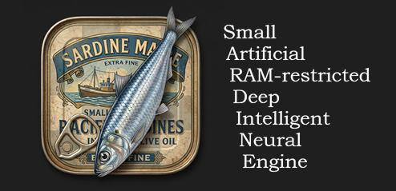
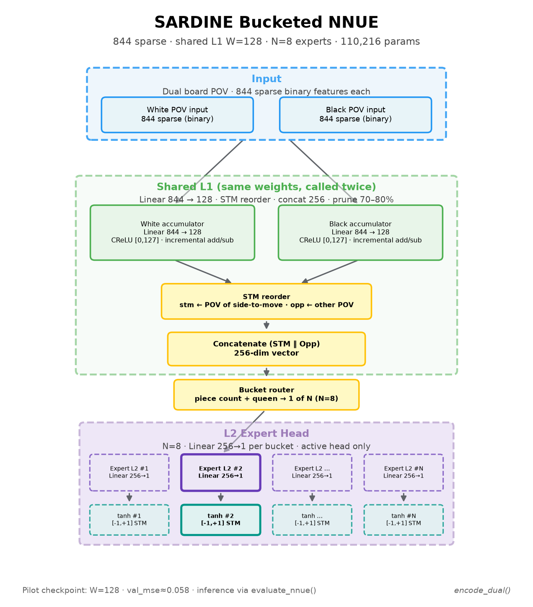
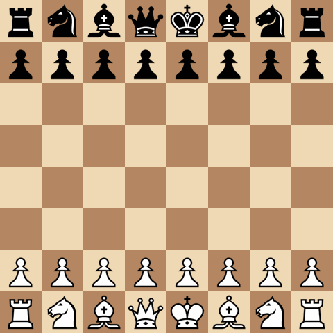

# DSAI Internship - Chess AI on TinyML



> *I am developing an end-to-end pipeline that optimizes a given chess engine based on specific hardware constraints. By applying compression techniques such as pruning and quantization, the framework aims to significantly reduce the model's footprint while preserving its original playing performance.*

- Presentation: [SARDINE_ICTP_2026-07.pdf](presentations/SARDINE_ICTP_2026-07.pdf)
- Engine blueprint: [SARDINE Engine Blueprint.md](NOTES/SARDINE%20Engine%20Blueprint.md)
- Status / design dashboard: [PROJECT.md](PROJECT.md)
- Online models: [Models.md](NOTES/Models.md)
- Kaggle challenge: [FIDE & Google Efficient Chess AI Challenge](https://www.kaggle.com/competitions/fide-google-efficiency-chess-ai-challenge)
- Pipeline assets: [ASSETS.md](ASSETS.md)
- Thesis ideas: [Thesis.md](NOTES/Thesis.md)

---

## SARDINE Pipeline

**SARDINE** — *Small Artificial RAM-restricted Deep Intelligent Neural Engine* — is a Wio Terminal chess engine targeting **~1700 Elo** and **~1 s/move**, under **192 KB RAM** and **~500 KB flash**. Full spec: [NOTES/SARDINE Engine Blueprint.md](NOTES/SARDINE%20Engine%20Blueprint.md).

| Piece | Choice |
|-------|--------|
| **Eval (target)** | Bucketed micro NNUE: shared **844 → W** ($W \in \{128, 256\}$, dual POV) → concat **2W** → expert **2W → 1** (×8 buckets); CReLU hidden, **tanh LUT** → expected reward $[-1,+1]$; dense train + gradual prune 70–80% → sparse int8 |
| **Eval (now)** | **HCE** default; **NNUE** via `--eval nnue` (`evaluate_nnue`, checkpoint `pilot_W128_844/best.pt`) |
| **Search (v1)** | Alpha-beta + quiescence, futility, LMR, null-move, lazy eval, iterative deepening; MVV-LVA + killers (depth > 4) |
| **Search (now)** | **v0.3:** fixed-depth alpha-beta + capture quiescence, MVV-LVA ordering, perft d5 |
| **Teacher** | Lc0 **latest best network** (`expected_reward = W − L` via UCI WDL, on-the-fly) |
| **Training data** | **Lichess PGN** → FEN (natural bucket distribution) + Lc0 supplement; ChessBench test split = **smoke only** |
| **Training (target)** | **nnue-pytorch** (844-dim bucketed), 100 ep, PTQ → QAT fallback; gradual L1 prune in training |
| **Training (now)** | PyTorch pilot smoke — `scripts/train_nnue.py` on ChessBench parquet (`pilot_W128_844`) |
| **Runtime** | C engine core on device (after PC bring-up); TFT + Serial; minimal UCI for Elo testing |
| **RAM** | TT-dominant (**128–160 KB**); accumulators + stack ~16 KB |

**Build order:** feature encoder ✅ → search skeleton (partial ✅) → train bucketed NNUE (pilot ✅) → queen-split ablation → incremental accumulators → C port → full search + **Elo gate ≥ 1700**.

**Active code:** `src/tinymlinternship/features/` (844 encoder: 716 base + tactical 128; **8 buckets** until ablation D), `src/tinymlinternship/engine/` (v0.3), `src/tinymlinternship/nnue/` (training), `src/tinymlinternship/data/` (Lc0 + ChessBench smoke), `src/tinymlinternship/visualization/` (pygame + GIF). Scripts: `run_engine.py`, `record_engine_game.py`, `lichess_pgn_to_fen.py`, `label_positions.py`, `train_nnue.py`, `download_lc0.py`, `prepare_chessbench_dataset.py`. Pre-SARDINE legacy tree removed (2026-07-22).

**Train NNUE pilot (smoke only)** — not the production path; validates encoder + engine wiring (844-dim, ChessBench splits, W=128):

```bash
pip install -e ".[train]"
py -3.12 scripts/prepare_chessbench_dataset.py   # if parquet still 716-dim
py -3.12 scripts/train_nnue.py --epochs 10 --run-name pilot_W128_844
```

**Replay a self-play game as GIF** (writes `images/sardine_game.gif`):

```bash
pip install -e ".[viz]"
py -3.12 scripts/record_engine_game.py
```

<div align="center">
    
</div>

See [NOTES/Commands.md](NOTES/Commands.md) for all commands.

---

## Games

**Engine self-play demos** (how each GIF was produced → result).  
**White / Black Elo** = Stockfish ACPL heuristic on that demo PGN (`Elo ≈ 2855 − 10×ACPL`, floor **400**), via `scripts/eval_game_elo.py`. Same agent plays both colors; single-game Elo is noisy when huge blunders/mates inflate ACPL. Multi-game ladder (bot ranking): [ASSETS.md](ASSETS.md) / `plots/PGN_and_JSON/*_gate_acpl.json` (e.g. HCE d1 **~400**, pilot NNUE d1 **~1465**, Cfish Hybrid d5 **~2435**).

| Description                                                                                                                                                                              | GIF                                                           |
| ---------------------------------------------------------------------------------------------------------------------------------------------------------------------------------------- | ------------------------------------------------------------- |
| **Omar game 2** <br>human blitz PGN (`omar-game-2.pgn`)<br>DrifS (1808) vs Omega0 (1819), 0-1<br>White **~400** (ACPL 1275)‡ <br>Black **~2590** (ACPL 27)                               |           |
| **Omar game 3** <br>human bullet PGN (`omar-game-3.pgn`)<br>Omega0 (1669) vs Petroliam89 (1694), 0-1<br>White **~1710** (ACPL 115) <br>Black **~1890** (ACPL 97)                         |           |
| **Omar game 4** <br>human blitz PGN (`omar-game-4.pgn`)<br>Omega0 (1938) vs GonzoII (2006), 1-0<br>White **~2540** (ACPL 31) <br>Black **~2435** (ACPL 42)                               |           |
| **NNUE d4 demo** <br>same pilot NNUE<br>αβ depth 4, **no** qsearch<br>max 40 plies<br>White **~2420** (ACPL 43) <br>Black **~2280** (ACPL 58)                                            |          |
| **NNUE depth 1** <br>pilot `pilot_W128_844` <br>pure NNUE <br>(844-dim dual POV),<br>alpha-beta depth 1<br>White **~2260** (ACPL 59) <br>Black **~2250** (ACPL 61)                       |          |
| **HCE depth 1** <br>hand-crafted eval<br>alpha-beta depth 1<br>**no** quiescence<br>White **~400** (ACPL 1548) <br>Black **~2230** (ACPL 62)                                             |           |
| **NNUE depth 2** <br>same pilot NNUE checkpoint<br>alpha-beta depth 2<br>White **~2135** (ACPL 72)† <br>Black **~2120** (ACPL 74)†                                                       |          |
| **HCE 1 s/move** <br>same HCE, iterative deepening<br>**movetime 1.0 s** (depth not fixed)<br>qsearch cap 6 · ½–½ @ 37 plies<br>White **~1230** (ACPL 162) <br>Black **~1960** (ACPL 90) |  |
| **NNUE d1 demo** <br>pilot `pilot_W128_844`<br>αβ depth 1, **no** qsearch<br>max 80 plies ([demo](demo/demo-nnue-gif.md))<br>White **~1720** (ACPL 113) <br>Black **~1630** (ACPL 123)   |          |
| **HCE depth 2** <br>same HCE value function<br>alpha-beta depth 2<br>**no** quiescence<br>White **~400** (ACPL 1519) <br>Black **~400** (ACPL 1516)                                      |           |
| **HCE d2 + qsearch** <br>same HCE<br>αβ depth 2, **with** qsearch<br>(cap 6), max 80 plies<br>White **~400** (ACPL 1525) <br>Black **~400** (ACPL 1524)                                  |   |
| **Depth-1 demo reel** <br>concat. HCE d1 + NNUE d1<br>                                                                                                                                   |      |
| **Depth-2 demo reel** <br>concat. HCE d2 + NNUE d2<br>                                                                                                                                   |      |


† NNUE d2: no `nnue_d2_game.pgn` beside the GIF; Elo from companion self-play `images/games/nnue_w128_844_d2_vs_nnue_w128_844_d2_2026-07-10.pgn`. Multi-game gate for this pilot at d2 is a known **collapse** (ACPL ~1590 / Elo floor **~400** in `nnue_d2_gate_acpl.json`).

‡ Omar 2/3/4: SF ACPL 100 ms/move — `omar_game_2_3_acpl.json`, `omar_game_4_acpl.json`. Omar 2 White floor driven by one mate-threat miss (`Rfd1` vs `Kh1`). Lichess ratings ≠ ACPL heuristic.

```bash
# Reproduce GIFs
pip install -e ".[viz]"
py -3.12 scripts/record_engine_game.py --eval hce --depth 1 --no-quiescence --headless --output images/games/hce_d1_game.gif
py -3.12 scripts/record_engine_game.py --eval hce --depth 2 --no-quiescence --headless --output images/games/hce_d2_game.gif
py -3.12 scripts/record_engine_game.py --eval hce --depth 2 --max-qsearch-depth 6 --max-plies 80 --headless --output images/games/hce_d2_qsearch_demo.gif
py -3.12 scripts/record_engine_game.py --eval hce --movetime 1.0 --max-qsearch-depth 6 --max-plies 60 --headless --output images/games/hce_movetime_1s_demo.gif
py -3.12 scripts/record_engine_game.py --eval nnue --depth 1 --headless --output images/games/nnue_d1_game.gif
py -3.12 scripts/record_engine_game.py --eval nnue --depth 2 --headless --output images/games/nnue_d2_game.gif
# Demo reels = concatenate HCE + NNUE GIFs for that depth → images/games/depth{1,2}_game_demo.gif

# Per-color strength on a demo PGN (needs Stockfish)
py -3.12 scripts/eval_game_elo.py --pgn images/games/nnue_d1_game.pgn --stockfish tools/stockfish/stockfish/stockfish-windows-x86-64-avx2.exe
```

---

#core