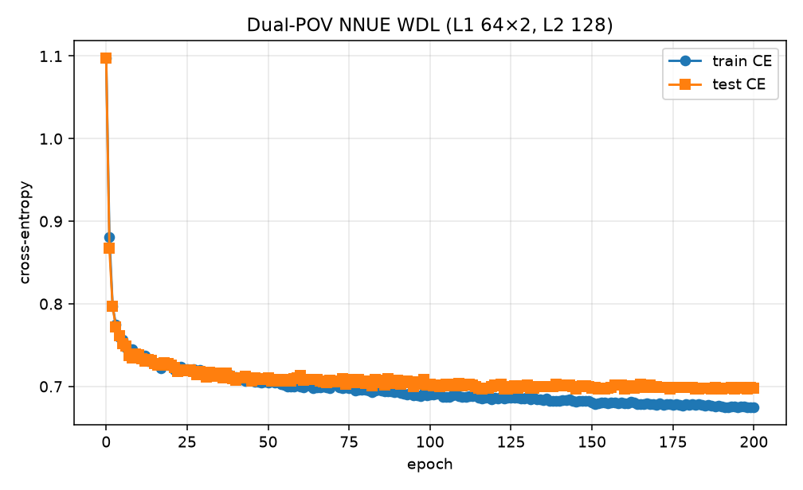

# SARDINE

**Small Artificial RAM-restricted Deep Intelligent Neural Engine**


> *End-to-end chess engine for tiny hardware: sparse dual-POV NNUE eval, Cfish αβ search, under tight RAM/flash.*

- Spec (five steps): **[Goal.md](Goal.md)**
- Status / dataset / notes for AI: **[PROJECT.md](PROJECT.md)**
- Train how-to: **[demo/demo-training.md](demo/demo-training.md)**
- Old 8-bucket / HCE / Python-engine / ICTP 2026-07 pipeline: **[LEGACY/](LEGACY/)**
- Presentation (ICTP): [LEGACY/presentations/SARDINE_ICTP_2026-07.pdf](LEGACY/presentations/SARDINE_ICTP_2026-07.pdf)
- Kaggle challenge: [FIDE & Google Efficient Chess AI Challenge](https://www.kaggle.com/competitions/fide-google-efficiency-chess-ai-challenge)

---

## Pipeline

Tiny-hardware chess bot (Wio-class: **~1700 Elo**, **~1 s/move**, **192 KB RAM**, **~500 KB flash**). Do the Goal steps in order.

| Step | What |
|------|------|
| 1 | Unique `{fen, wdl, visits}` table from games + an Lc0 teacher |
| 2 | Train a dual-POV 2-hidden NNUE \(f_w\) (sparse 844 → L1 accumulator → L2 → WDL softmax) |
| 3 | Task-vector clusters, linear dispatcher on \(h\), freeze L1, fine-tune expert heads |
| 4 | Keep **Cfish** αβ; replace only `evaluate` / `nnue_evaluate` |
| 5 | ACPL and STS supporting; BayesElo match vanilla vs MoE is the ship gate |

### Model Architecture

| Piece | Choice |
|-------|--------|
| **Input** | Sparse **844** (piece-square + king file-mirror + castling + EP + tactical planes) |
| **L1** | Shared `844 → W` (`W = 64` in the current student), **dual POV**: own-side + opponent-side (board mirrored). CReLU. Concat `[STM ‖ opp]` → `2W`. Incremental add/sub on make/unmake. |
| **L2** | `2W → 128` CReLU |
| **Output** | Three logits, **softmax** → STM \((W, D, L)\) on \([0,1]\), \(W+D+L=1\) |
| **Teacher** | Lc0 (`791556.pb.gz`): native STM WDL. Soft labels; loss is cross-entropy. White-POV \(v = \pm(W-L)\) is derived. |
| **Search** | **Cfish** αβ (stock eval until the student hook lands). Launch: `run-cfish.bat` |
| **MoE (later)** | Cluster task vectors on the head, linear dispatcher on \(h\), freeze L1, fine-tune expert heads |


<div align="center">
    
</div>

```text
white / black sparse 844
        │
   L1 Linear 844 → 64 + CReLU   (shared, run twice)
        │
   concat [STM ‖ opponent] → 128
        │
   L2 Linear 128 → 128 + CReLU
        │
   head Linear 128 → 3 + softmax → STM WDL (Win, Draw, and Loss **for the current player**) ∈ [0, 1]
```

~70 979 parameters at the default widths. Train from per-slice `features.npz` (test = random 10% of each slice). Re-encode slices after the WDL schema change.

```powershell
pip install -e ".[train]"
py -3.12 -u scripts/encode_slice_features.py --rebuild
py -3.12 -u scripts/train_nnue.py --epochs 5 --smoke --run-name dual_W64_H128_wdl_smoke --plot plots/nnue_smoke_ce.png
py -3.12 -u scripts/train_nnue.py --epochs 10 --run-name dual_W64_H128_wdl --plot plots/nnue_ce.png
```

See [demo/demo-training.md](demo/demo-training.md) for the fast command and artifact paths.

### Live tree

- `data/raw/` — conversion sources (Lc0, Lichess, Kaggle)
- `data/processed/board_eval/fen_value_visits/<slice>/` — Goal §1 JSON + `features.npz`
- `models/teacher/lc0/` — Lc0 binary + `791556.pb.gz`
- `src/cfish/` — Cfish search (Goal §4)
- `src/tinymlinternship/nnue/` — DualHidden student
- `tools/stockfish/` — ACPL judge (Goal §5)

---

## Games

**Engine self-play demos** from the previous pipeline (HCE / pilot NNUE / human PGNs).  
**White / Black Elo** = Stockfish ACPL heuristic (`Elo ≈ 2855 − 10×ACPL`, floor **400**). Same agent plays both colors; single-game Elo is noisy.

| Description                                                                                                                                                            | GIF                                                           |
| ---------------------------------------------------------------------------------------------------------------------------------------------------------------------- | ------------------------------------------------------------- |
| **Omar game 2** <br>human blitz PGN (`omar-game-2.pgn`)<br>DrifS (1808) vs Omega0 (1819), 0-1<br>White **~400** (ACPL 1275)‡ <br>Black **~2590** (ACPL 27)             |           |
| **Omar game 3** <br>human bullet PGN (`omar-game-3.pgn`)<br>Omega0 (1669) vs Petroliam89 (1694), 0-1<br>White **~1710** (ACPL 115) <br>Black **~1890** (ACPL 97)       |           |
| **Omar game 4** <br>human blitz PGN (`omar-game-4.pgn`)<br>Omega0 (1938) vs GonzoII (2006), 1-0<br>White **~2540** (ACPL 31) <br>Black **~2435** (ACPL 42)             |           |
| **NNUE d4 demo** <br>pilot NNUE<br>αβ depth 4, **no** qsearch<br>max 40 plies<br>White **~2420** (ACPL 43) <br>Black **~2280** (ACPL 58)                               |          |
| **NNUE depth 1** <br>pilot `pilot_W128_844` <br>pure NNUE (844-dim dual POV)<br>alpha-beta depth 1<br>White **~2260** (ACPL 59) <br>Black **~2250** (ACPL 61)          |          |
| **HCE depth 1** <br>hand-crafted eval<br>alpha-beta depth 1<br>**no** quiescence<br>White **~400** (ACPL 1548) <br>Black **~2230** (ACPL 62)                           |           |
| **NNUE depth 2** <br>same pilot NNUE checkpoint<br>alpha-beta depth 2<br>White **~2135** (ACPL 72)† <br>Black **~2120** (ACPL 74)†                                     |          |
| **HCE 1 s/move** <br>same HCE, iterative deepening<br>**movetime 1.0 s**<br>qsearch cap 6 · ½–½ @ 37 plies<br>White **~1230** (ACPL 162) <br>Black **~1960** (ACPL 90) |  |
| **NNUE d1 demo** <br>pilot `pilot_W128_844`<br>αβ depth 1, **no** qsearch<br>max 80 plies<br>White **~1720** (ACPL 113) <br>Black **~1630** (ACPL 123)                 |          |
| **HCE depth 2** <br>same HCE<br>alpha-beta depth 2<br>**no** quiescence<br>White **~400** (ACPL 1519) <br>Black **~400** (ACPL 1516)                                   |           |
| **HCE d2 + qsearch** <br>same HCE<br>αβ depth 2, **with** qsearch (cap 6)<br>White **~400** (ACPL 1525) <br>Black **~400** (ACPL 1524)                                 |   |
| **Depth-1 demo reel** <br>concat. HCE d1 + NNUE d1                                                                                                                     |      |
| **Depth-2 demo reel** <br>concat. HCE d2 + NNUE d2                                                                                                                     |      |

† NNUE d2: companion self-play PGN in `LEGACY/images/games/`. Multi-game gate for that pilot at d2 collapsed (Elo floor **~400**).

‡ Omar 2 White floor: one mate-threat miss. Lichess ratings ≠ ACPL heuristic.

Reproduce GIFs (old Python engine, from `LEGACY/`):

```powershell
pip install -e ".[viz]"
py -3.12 LEGACY/scripts/record_engine_game.py --eval hce --depth 1 --no-quiescence --headless --output images/games/hce_d1_game.gif
py -3.12 LEGACY/scripts/record_engine_game.py --eval nnue --depth 1 --headless --output images/games/nnue_d1_game.gif
```

---

## Notes
### Dual POV

The same weights in the L1 layer are called twice, to produce two sets of activations:
- **1st call**: board from the **side‑to‑move**'s POV (no transform).
- **2nd call**: board is **rank‑flipped** (mirrored vertically, ranks 1↔8) and colors are swapped.

This way, the network does not have to re-learn symmetrical patterns (e.g., pawns always move forward, castling is always on the same side from each player's perspective).

## Board Mirroring

In the current pipeline, **board mirroring** is baked into the 844 encoder when each FEN is turned into `features.npz`. Training never sees a board — only those already-mirrored sparse indices.

### STM Reorder (Perspective‑Invariance)

The two accumulator vectors (`h_own` and `h_opp`) are **reordered** before being concatenated and fed to the expert head. The vector corresponding to the **side to move** always comes first, and the opponent's vector comes second. This makes the evaluation output **perspective‑invariant** — the network always evaluates from the point of view of the player whose turn it is.

### CReLU

The Concatenated Rectified Linear Unit (CReLU) is an activation function for deep learning that doubles the output channel dimension by applying both positive and negative ReLU transformations: $f(x) = [\text{ReLU}(x), \text{ReLU}(-x)]$. It captures opposite-phase features in early convolutional layers. 

---

## Training

Goal §2 is in progress: STM WDL student, soft cross-entropy, per-slice `features.npz`. Commands and split: [demo/demo-training.md](demo/demo-training.md).

Current best performing Dual-POV **NNUE**:

<div align="center">
    
</div>
